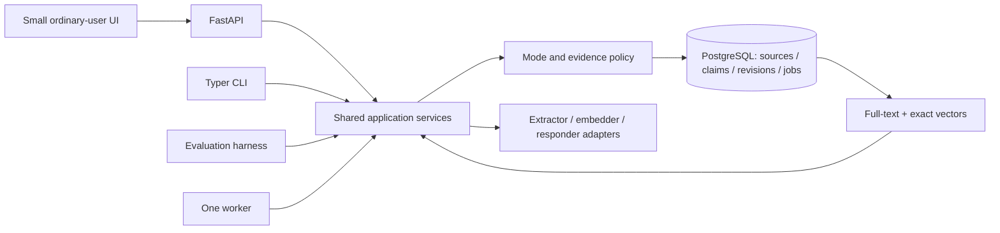

# Proposed memory architecture

Status: S03 infrastructure is implemented and checked; memory behavior below remains a design to implement and evaluate. Agreed behavior lives in [DECISIONS.md](DECISIONS.md), and [RUN.md](RUN.md) records actual bootstrap evidence.

## One application, several entry points

The API, CLI and worker are adapters around the same operations: import, process, ask, inspect, correct, forget and evaluate. No client writes directly around policy. One Python image serves API, worker, CLI and tests. S03 Compose runs `db`, one-shot `migrate`, `api` and a `cli` tools profile; `compose.test.yaml` supplies a standalone test project. `worker` and a thin `frontend` remain later work.

Run DB migrations once, wait for DB health and successful migrations, and use named volumes. Tests get a separate database and credentials with no access to the normal data volume. Compose startup order alone does not prove readiness; use health and completion conditions. [Docker guidance](https://docs.docker.com/compose/how-tos/startup-order/)

The initial review service binds to loopback and uses a server-controlled local user identity. Never trust a submitted `user_id` as authorization. Keep ownership checks and cross-user test fixtures even for a single-user demo. Public deployment would require an additional approved authentication/security pass.

S03 stores only policy, source and job records. The fixed synthetic CLI probe uses one transaction and the owner policy-row lock; API/CLI liveness and DB/schema readiness share `Service`. pgvector is installed, with no embeddings or search indexes. The full operations and lifecycle guarantees below are not implemented by these foundations.

## Evidence representation

The assignment uses **semantic memory as a broad product term**: our planned scope includes facts, scoped preferences and useful episodes. In the narrower content taxonomy, semantic understanding means reusable facts/preferences, episodic understanding preserves reported happenings and their context, and procedural knowledge describes how to act. We defer **automatic procedural learning**, not episodic understanding. This is our scope choice; the brief does not mandate that deferral. [Brief locators and terminology sources](docs/visual-guide-references.md#assignment-brief)

History preserves original records and their support for derived understanding. Persistence describes lifetime independently of content kind, and these categories do not require separate databases. A reported event is not an independently verified action; ordinary reviewed code and prompts can guide behavior without learning procedures automatically.

| Logical record | Required information |
| --- | --- |
| Source observation | Stable user/import/source identity; raw and formatted variants; available capture/app metadata; version and content hash. Missing metadata stays unknown. |
| Passage | Source version and exact text offsets or a verified exact excerpt; Unicode offset convention documented. |
| Claim revision | Subject/entity, predicate, typed value, units, scope, attribution, negation, modality, temporal qualifiers and evidence links. |
| Claim state | Separate evidence status (reported, tentative, disputed) from lifecycle (active, superseded, corrected, excluded). |
| Relations / derivations | Evidence-backed supersedes, contradicts, conditional-on and source→claim→index dependencies. Graph edges can live in ordinary tables. |
| Policy / exclusions | Per-user revision plus minimal restrictions covering selected support, known duplicates and reimports. |
| Jobs / operation trace | Idempotency key, attempt, source/model/prompt revisions, selected evidence, stage timing, result/error category and actual outcome. |

Do not call a proposed, reported or inferred claim independently verified. Distinguish capture time, import/record time, event time and the period a claim applies. A launch date is not its claim's `valid_from`. Unknown effective times remain unknown. Newest ingestion must not automatically win. [Bitemporal history](https://martinfowler.com/articles/bitemporal-history.html), [W3C provenance](https://www.w3.org/TR/prov-overview/)

## Learning and reconciliation

1. Enforce mode and source eligibility before saving or queuing. Eligible user messages and imported dictations can teach memory; generated replies/drafts do not independently corroborate facts. Imported instructions remain data.
2. Preserve raw/formatted variants under one observation ID. Exact reimport is idempotent; identical words from genuinely different observations remain distinguishable.
3. A bounded extractor proposes structured claims, supporting passages, scope and uncertainty. Supply enough permitted surrounding context to resolve pronouns; never infer a subject just because its name appears elsewhere in memory.
4. Code checks schema, source ownership, real passages, exclusions and allowed transitions. These checks verify structural validity; a real source span does not itself prove semantic entailment. Evaluate extraction faithfulness separately.
5. Compare with related current and historical claims for the same subject/property/scope. Exact rules handle known duplicates; a model may propose semantic relationships. Commit a new fact, additional support, successor, corrected interpretation or unresolved conflict as appropriate.
6. Write canonical revisions and a job/outbox record atomically. Build lexical/vector views from committed state. Expose pending, ready and failed processing; permitted original-history search remains available if extraction is missing or fails.

Model/network calls run outside database locks. Before committing results, acquire the same per-user policy-row lock used by Correct/Forget and verify source/claim/policy revisions inside that transaction. An equivalent atomic compare-and-swap protocol is acceptable. A pre-check followed by an unguarded write races. [PostgreSQL locking](https://www.postgresql.org/docs/current/explicit-locking.html)

For live Normal requests, current input is available immediately to answer generation. Routine extraction may run after saving the source. Explicit corrections/Forget resolve through the control path before reporting success; a control message must not relearn the information it excludes. Read-your-write behavior uses the current source/canonical state even while indexes lag.

## Retrieval and context

Private bypasses saved personal data entirely. Normal requests first establish intent, entity and time scope. A self-contained question can skip personal retrieval; a personal or historical question uses permitted stored evidence. Current explicit instructions override remembered preferences for that request without silently rewriting the long-term preference.

Retrieve from eligible source passages and, when enabled, claims. Union lexical and exact dense candidate lists, deduplicate by identity, resolve temporal/conflict status, then fuse or rerank. Revalidate canonical access/exclusion state before any candidate reaches a model. A historical query may use superseded versions; a current question must not present them as current.

PostgreSQL full-text ranking is the lexical baseline, not automatically BM25. pgvector supports exact search; test ANN only if measured latency warrants its recall tradeoff. At approximately 500 observations, the number of claims/chunks may exceed 500. Exact vector work is O(Nd) for N candidate vectors of dimension d. [pgvector](https://github.com/pgvector/pgvector)

Candidate fusion can use `RRF(d) = Σ 1 / (60 + rank(d))` across lists containing candidate d; ranks begin at 1. This combines rankings, not truth probabilities. A candidate absent from the dense list can still enter through lexical retrieval; reranking a dense-only pool cannot recover it. Preserve complementary evidence within the prompt token budget. Reserve tokens for instructions, current input and the reply. [RRF paper](https://cormack.uwaterloo.ca/cormacksigir09-rrf.pdf), [contextual retrieval](https://www.anthropic.com/engineering/contextual-retrieval)

Pass a compact packet of claims, original supporting passages, identifiers, time and uncertainty to the responder. Check source references mechanically; semantic support still requires model evaluation or human review. Ask a short clarification when decisive evidence conflicts. Abstain when the permitted history cannot support the answer; do not label an unavailable search as absent evidence.

## Correct, Forget and Private

**Correct:** preserve source history. An extraction error retracts the wrong interpretation; a genuine change creates a supported successor and retains earlier state. Invalidate dependent indexes and any future summaries/caches. A later retrieval must use the new state.

**Forget:** exclude selected claims and their supporting passages, covering known duplicates/reimports/reprocessing; invalidate all usable derivatives and pending work. Source history can remain separately visible until deleted. Workers and controls share the commit guard. Retrieval and buffered reply publication also check revocation, with a defined atomic release boundary. Already released replies cannot be unsent. Start without streaming or response caches to reduce these races.

**Private:** current input and explicitly supplied temporary context only. No personal memory/history/dictionary/style reads, durable content/activity writes, extraction jobs, logs, error payloads, caches, embeddings, retries, exports or browser persistence. Enter with fresh context; discard on exit/page close; never backfill Normal. Persist only the switch preference. Hosted inference retention and no-training settings must be separately checked and disclosed.

## Models and repair

The user selected **DeepSeek for the main reasoning/response role**, with a smaller model to propose memory operations. The following exact hosted candidates were checked against public provider/model documentation on 11 September 2026; account access and actual behavior have not been tested.

| Role | Candidate | Selection reason and limit |
| --- | --- | --- |
| Main reasoning / response | NVIDIA `deepseek-ai/deepseek-v4-pro-0813` at `https://integrate.api.nvidia.com/v1` | A documented dated DeepSeek endpoint. Probe callability and hosted output/tool behavior; do not assume strict schema enforcement. |
| Small-operation candidate A | NVIDIA `nvidia/nemotron-3.5-lightning-30b-a3b` at the same endpoint | Reuses one provider/key; documented tools and structured-output training. 30B total / 3B active is sparse computation, not a 3B local memory footprint. Hindi/Hinglish quality needs testing. |
| Small-operation candidate B | SiliconFlow `Qwen/Qwen3-8B` at `https://api.siliconflow.com/v1` | Dense 8.2B multilingual comparison candidate. Provider documents non-thinking and JSON modes; JSON validity does not prove schema compliance or factual support. Requires another provider/key. |
| Optional dense retrieval | SiliconFlow `Qwen/Qwen3-Embedding-0.6B` at its embeddings API | Multilingual embedding candidate; fix supported dimension and query convention, version the index, and compare with lexical retrieval. |

Start with the NVIDIA main + candidate A smoke test if that account is ready. Compare candidate B on the same small labeled set when access/budget allows; a second provider must not block source import, lexical retrieval, controls or the UI. Do not select a winner from advertised parameter count or benchmark scores. Prefer hosted inference for the deadline; no new local GPU-serving stack.

Sources: [DeepSeek NVIDIA endpoint](https://build.nvidia.com/deepseek-ai/deepseek-v4-pro-0813), [Nemotron endpoint](https://build.nvidia.com/nvidia/nemotron-3.5-lightning-30b-a3b), [Nemotron model card](https://huggingface.co/nvidia/NVIDIA-Nemotron-3.5-Lightning-30B-A3B-BF16), [Qwen3-8B card](https://huggingface.co/Qwen/Qwen3-8B), [SiliconFlow chat contract](https://docs.siliconflow.com/en/api-reference/chat-completions/chat-completions), [JSON mode](https://docs.siliconflow.com/en/userguide/guides/json-mode), [embedding API](https://docs.siliconflow.com/en/api-reference/embeddings/create-embeddings), [embedding card](https://huggingface.co/Qwen/Qwen3-Embedding-0.6B).

Prototype availability is not a service guarantee. Confirm account quotas, retention, no-training settings and a spend ceiling before calls. Model catalogs change: some older NVIDIA small-model endpoints are deprecated, and direct DeepSeek aliases are being changed. Do not silently substitute an alias or provider; record the configured and returned model identifiers and test date. [Example deprecated endpoint](https://build.nvidia.com/microsoft/phi-4-mini-instruct), [DeepSeek current model contract](https://api-docs.deepseek.com/quick_start/pricing/).

The smaller model returns typed proposals such as `ADD_CLAIM`, `LINK_EVIDENCE`, `PROPOSE_SUPERSESSION`, `NOOP` or `NEEDS_CLARIFICATION`, with source references, exact support and expected revisions. It does not receive unrestricted SQL execution, choose the authenticated user, or bypass transitions. Free-form destructive database commands are outside its tool surface.

Provide small interfaces such as `Extractor.propose`, `Embedder.embed` and `Responder.answer`, with configured model IDs, schema/prompt versions, timeouts and usage accounting. Persist per-call accounting only for permitted Normal/evaluation activity; Private uses transient counters and no durable activity records. Provider-side billing and retention are separate disclosed boundaries. The same provider may serve several roles. A smaller extractor is a hypothesis to test; establish a stronger-model reference on the same cases. Deterministic test doubles are explicitly labeled and never count as live-model results.

Use at most one bounded schema-repair retry initially. Record failed/retried call usage only in permitted Normal/evaluation traces. Any Private retry is transient within its active session, never a durable job or retry payload. Do not infer model quality from parameter count or self-reported confidence. Keep retention/no-training settings and a spend ceiling explicit. A stronger model cannot recover absent personal evidence.

Negative feedback links to the original operation. Distinguish a wrong source/interpretation, missed retrieval, outdated fact, unsupported generation, failed tool, wrong style or ambiguous rejection. Fix the failing layer; ask when the corrected value or scope is unknown; rerun once and add a regression case. Save only eligible supported corrections or explicit scoped preferences. Do not automatically rewrite global instructions or train model weights. [Self-Refine](https://arxiv.org/abs/2303.17651), [Reflexion](https://arxiv.org/abs/2303.11366)

Concise Normal traces record observable decisions, selected evidence, versions, timings and actual outcomes, not purported hidden thoughts. Imported commands never authorize external actions, and a draft remains a draft. The initial product does not send messages or modify external applications.
