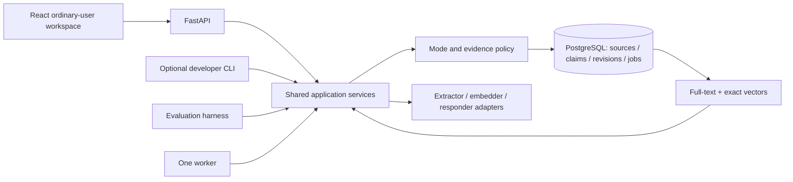

# Proposed memory architecture

## Interview conversation learning (22 September 2026)

Normal browser Ask now preserves its user-authored message, learns selectively, then answers. `POST /conversation/messages` validates an immutable message UUID, conversation UUID and existing Ask request; one guarded transaction creates a `user_message` Source plus Job. Exact retries reuse the original. A new turn with repeated words is still a separate source. Assistant answers are not accepted by this capture contract. No schema migration or new dependency is needed.

`POST /conversation/messages/{source_id}/learn` authorizes the owned source, requests only its job and calls the existing worker with a source filter. The extraction packet adds at most six earlier eligible user messages from the same collection/conversation for reference resolution, plus bounded relevant current memories. The model proposes add/support/supersede/correct/conflict or duplicate/no_memory/needs_clarification. Exact same-content additions to a known chat memory are rejected. Every committed operation needs evidence from the current user message; a follow-up can also cite its antecedent. Claims keep revision history, scope and uncertainty. Exclusions, provider budgets, lease checks and revocation remain backend-owned.

The browser shows the save receipt immediately, performs learning, and then calls the read-only `/ask` path. Saving, learning and answering have independent outcomes: extraction failure preserves the message and still permits an answer from eligible original text. Completed learning is idempotent on an answer retry. Failed learning requires an explicit bounded retry (three job attempts, at most two proposal calls per attempt). A busy lease is polled for up to eight checks; remaining work is visibly pending. Closing the browser can leave a saved pending job: use Retry learning or Memory → Process sources to resume. This is active learning during submission, not a newly deployed unattended background worker.

Model examples expose quote-only passages, matching their output schema; code derives exact offsets. The one repair attempt gets a bounded structural field/error hint without rejected values or raw exception text. Saving a question does not establish its premise. `/ask` remains read-only for CLI/evaluation clients, keeping evaluation questions out of their corpora. Private never calls the capture/learning endpoints and has no saved context or backfill. Clearing the displayed conversation starts a new reference context; saved originals remain in Sources.

## Implemented S09 lifecycle and answer path

`Service` composes `answers.py`, `controls.py`, processing and retrieval; API, optional developer CLI, worker and evaluator share authorization, policy guards and evidence validation. `POST /ask` reads current permitted evidence, reserves call allowance, performs bounded inference outside SQL locks, then rechecks the complete packet and citations while serializing the buffered response. Unknown evidence and operational failure are distinct. Generated questions/replies never become observations, claims or jobs. Normal accounting contains identifiers, usage, model/prompt versions, request hashes and fixed errors; it excludes prompts, answers and hidden reasoning. The explicit synthetic evaluator alone emits reviewed public completion content.

Migration `0005_user_controls` adds owned control, feedback, source-exclusion and passage-exclusion receipts plus nullable request/policy/feedback references on model calls. Existing source strings and S03–S08 rows are preserved. All saved operations, including failures, reject Private before reading request bodies or accessing the store. Private is temporary local context here; it does not make a provider call. Browser state is transient. Normal screen navigation preserves current work; mode/collection changes, page exit/restoration and committed controls clear relevant content. Late responses cannot restore a discarded session.

`POST /controls/preview` validates the latest owned active target and returns a digest of the exact proposed replacement and affected notes. `/controls/apply` revalidates under the same owner policy lock, checks an idempotency receipt, increments policy revision and atomically commits evidence, revision/relationship, exclusions and job invalidation. Correct creates a `corrected` predecessor; world change creates `superseded` history. User statements and confirmed typed content form a new observation with unknown capture time; their jobs are cancelled as `control_input`, never extracted again. Retrieval attaches mandatory amendment sources in policy order, also when searching known exact copies in another collection.

Forget covers all supporting observations across the selected claim's revisions, their dependent claims, known full-variant copies and literal excluded passages in reimports. Original source inspection remains available. Source-only fallback, claim validation, imports, workers, retrieval and buffered publication all consult the same exclusions. Whole-observation exclusion is deliberately conservative; novel paraphrases and semantic identity are not inferred. Known wrong typed interpretations from Correct cannot be re-added from their original observation or exact copy. Tests use separate PostgreSQL connections and barriers for both control/worker and control/reply commit orderings. Already released bytes cannot be recalled.

`POST /feedback` checks the owned call/request identity. Vague feedback requests detail; memory, world change and style feedback guide an explicit correction or current-request instruction. Retrieval/generation diagnoses permit one persisted retry; retrieval uses the all-history alternative under the same allowance. No retry chain, automatic model fallback or automatic global preference is created.

Live trial eligibility is backend owned: eight exact public dictations, eight fixed public questions and two full public control observations. Compare every source field and confirmed control value before network access. The approved combined allowance is 96 requests/1,500,000 tokens/$0 paid, including failures and repairs; it survives restarts. Personal inference remains blocked. [Actual results and limitations](RUN.md#s09-controls-and-synthetic-ask)

Status: S03-S10 infrastructure and deterministic workflows are implemented. Live extraction/answer reliability and semantic quality remain open gates. See todo.md and RUN.md for the current evidence.

## One application, several entry points

The API, CLI and worker are adapters around shared operations. Import, process, inspect, search, Ask and reviewed lifecycle controls exist; live answer/extraction quality remains open. No client writes directly around policy. One Python image serves Compose `db` clients: one-shot `migrate`, `api`, `worker` and the optional `cli` profile. `compose.test.yaml` supplies a standalone test project. The minimal frontend is served by FastAPI at `/`; no separate frontend service is needed. Users work in the browser; the CLI is optional for developers.

Run DB migrations once, wait for DB health and successful migrations, and use named volumes. Tests get a separate database and credentials with no access to the normal data volume. Compose startup order alone does not prove readiness; use health and completion conditions. [Docker guidance](https://docs.docker.com/compose/how-tos/startup-order/)

The initial review service binds to loopback and uses a server-controlled local user identity. Never trust a submitted `user_id` as authorization. Keep ownership checks and cross-user test fixtures even for a single-user demo. Public deployment would require an additional approved authentication/security pass.

S03 stores policy, source and job records; S04 adds owned exact passages, claim revisions and evidence links. All adapters share `Service`, a backend-issued context and the owner policy-row guard. S05 adds import/inspection; S07 adds processing/reconciliation and accounting. S08 adds GIN text-search indexes; pgvector is installed but no embeddings are stored. S09 adds the guarded answer/control path described above; future model-quality and broader-corpus gates remain distinct.

## Evidence representation

The assignment uses **semantic memory as a broad product term**: our planned scope includes facts, scoped preferences and useful episodes. In the narrower content taxonomy, semantic understanding means reusable facts/preferences, episodic understanding preserves reported happenings and their context, and procedural knowledge describes how to act. We defer **automatic procedural learning**, not episodic understanding. This is our scope choice; the brief does not mandate that deferral. [Brief locators and terminology sources](docs/visual-guide-references.md#assignment-brief)

History preserves original records and their support for derived understanding. Persistence describes lifetime independently of content kind, and these categories do not require separate databases. A reported event is not an independently verified action; ordinary reviewed code and prompts can guide behavior without learning procedures automatically.

| Logical record | Required information |
| --- | --- |
| Source observation | Stable user/import/source identity; raw and formatted variants; available capture/app metadata; version and content hash. Missing metadata stays unknown. |
| Passage | Source version and exact text offsets or a verified exact excerpt; Unicode offset convention documented. |
| Claim revision | Subject/entity, predicate, typed value, units, scope, attribution, negation, modality, temporal qualifiers and evidence links. |
| Claim state | Separate evidence status (reported, tentative, disputed) from lifecycle (active, superseded, corrected, excluded). |
| Relations / derivations | Evidence-backed supersedes, contradicts, conditional-on and source→claim→index dependencies. Graph edges can live in ordinary tables. |
| Policy / exclusions | Per-user revision plus minimal restrictions covering selected support, known duplicates and reimports. |
| Jobs / operation trace | Idempotency key, attempt, source/model/prompt revisions, selected evidence, stage timing, result/error category and actual outcome. |

Do not call a proposed, reported or inferred claim independently verified. Distinguish capture time, import/record time, event time and the period a claim applies. A launch date is not its claim's `valid_from`. Unknown effective times remain unknown. Newest ingestion must not automatically win. [Bitemporal history](https://martinfowler.com/articles/bitemporal-history.html), [W3C provenance](https://www.w3.org/TR/prov-overview/)

## Implemented S04 contract boundary

Source identity is owner + source key; each revision has a distinct source-row ID and one raw/formatted pair. Original text, nullable capture metadata and actual import time remain separate. New source writes require the expected current source/policy revision; previous revisions are preserved. The new provenance column defaults existing records to `unknown`, which cannot support a claim until a later explicit eligibility path exists.

Supporting passages identify source ID/revision, raw or formatted variant, zero-based half-open Unicode code-point offsets and the exact text. The service validates owned latest sources under the commit guard; relational foreign keys also enforce source/passage/claim ownership. Claim content is a validated JSONB value with typed subject/attribution labels, value and units, scope, uncertainty, negation, condition and explicit-precision time. Revision/lifecycle/owner fields and evidence links are relational. JSONB keeps the bounded contract readable without introducing an entity/search schema before its milestone.

Entity IDs remain null until a backend registry exists. Calendar dates are not coerced into instants; numeric/naive timestamps are rejected, and unknown event/effective times remain unknown. Tentative or conditional meaning is retained. An exact real passage establishes a structurally valid reference, not semantic entailment or independent truth.

Every implemented personal-store service operation gates Private before session creation. Current-input observation validation is pure and permitted in either mode. API/CLI errors expose only fixed categories; the supported Compose API/CLI have no persistent container logs. No content, prior context or activity is retained between validation calls. Mode is explicit per request; persistent mode preference, provider behavior and full controls are not implemented. The later UI foundation below adds transient page state and mode clearing. [Actual checks and limits](RUN.md#actual-s04-results)

## Implemented S05 import boundary

An import namespace and original record ID map reversibly to `import:<namespace>:<record_id>` in the existing owner-scoped source key. Each component is 1–96 ASCII letters/digits/dots/underscores/hyphens, starting with a letter or digit; case matters. Keep the namespace stable across exports/retries of the same source collection. Different namespaces or IDs mean different observations even when text matches. The key prefix is reserved from generic source writes. This uses the existing schema; S05 adds no migration or dependency.

The UTF-8 JSONL contract requires `record_id` and `raw_transcript`; `formatted_text` and `metadata` are optional/null. Metadata objects are retained, with an explicitly zoned `captured_at` copied to the typed capture-time field when supplied. Missing metadata remains null; an explicit empty object stays empty. Unknown top-level fields, generated-message role selectors, duplicate keys/IDs, invalid times and unsupported JSON/text fail closed. Caller-supplied dictations are the eligible source kind; the importer does not execute text or establish its truth. [Full limits and commands](RUN.md#s05-import-and-inspection)

Validate the whole bounded batch before SQL. Under the same owner policy lock as S04 writes, require the current policy revision, compare any existing observation and atomically insert all new sources and their pending ingestion jobs. Equal source fields/metadata return the same source/job IDs without changing timestamps, attempts or job status. JSON object order/numeric notation is immaterial; booleans differ from numbers. Any changed field under an existing identity returns `import_conflict` and writes nothing from that batch. Import cannot silently revise, correct, relabel or retry a failed job. A genuinely new observation needs its own original ID; corrected source exports await an explicit revision/control workflow.

Private denies import before reading API bodies/CLI stdin, and denies listing/inspection before DB access. Shared services independently enforce the same gate. Read-only pages return current policy revision and an opaque-to-clients source-row ID for inspection; exact variants and ingestion job status are available from that ID. Jobs remain pending until a later worker exists. Known-duplicate exclusion and no-resurrection after Forget belong to S09; namespace identity alone does not implement those controls.

## Implemented browser workspace

The React/TypeScript source in `frontend/` produces local JS/CSS/font assets in generated `src/kivi/web/`. A pinned Node Docker stage runs `npm ci` and type-checks/builds; the Python wheel explicitly includes its result. No Node process runs in the application container. Public shell/readiness requests do not read saved personal content.

`ApiSession` owns abort controllers for one ephemeral Normal mount, with stale-response checks after headers and JSON parsing. Disposing the session prevents new chained requests. Four screen components use the shared state hook and existing HTTP/service contracts. No saved reads occur on startup or mere screen navigation; Open, Refresh, Search, import and other explicit actions request them. Current conversation turns are bounded to twelve in page memory. There are no cookies, local/session storage, IndexedDB, service workers, external fonts, analytics or persistent client cache.

Save a note converts exact typed/pasted raw and optional formatted variants into one existing JSONL observation. A stable ephemeral UUID survives a lost-response retry; successful save or input edits generate a new ID. No capture timestamp is invented. This path does not automatically request learning. Model gating remains backend-owned, including the exact synthetic allowlist.

Correct/world-change/Forget retain typed qualifiers and explicit impact preview/commit. Success clears answers, search results, source inspection and old history. Private synchronously removes the Normal component tree, cancels pending operations, clears temporary content on exit and never backfills. Pagehide/pageshow handling prevents restored personal DOM. Private scratchpad text never reaches the API. Previously accepted Normal jobs may finish independently.

Motion describes actual pending requests and reveals validated buffered answers; it does not simulate token streaming or hidden thinking. CSS and Motion respect reduced-motion preferences. shadcn/Radix dialogs provide focus containment/Escape behavior, with per-response nonces authorizing generated scroll-lock styles. Script policy remains same-origin without inline scripts; fonts are local and all responses remain no-store. Production serves only generated assets, excluding source maps and credentials. Browser checks use the isolated PostgreSQL service and deterministic providers, separately from live quality.

## Learning and reconciliation

Saving permitted history and selecting useful memory are separate decisions. A source can yield zero claims. Extract reusable facts, scoped preferences and useful reported events; do not turn a question into its assumed answer or a current-request instruction into a lasting preference. Preserve a useful conditional plan as conditional, while keeping quoted/hypothetical content attributed rather than treating it as an unconditional user fact. Each claim should express one proposition with enough scope, condition, time and attribution to preserve its meaning. [Research rationale and limits](DECISIONS.md#input-to-memory-research-review)

1. Enforce mode and source eligibility before saving or queuing. Eligible user messages and imported dictations can teach memory; generated replies/drafts do not independently corroborate facts. Imported instructions remain data.
2. Preserve raw/formatted variants under one observation ID. Exact reimport is idempotent; identical words from genuinely different observations remain distinguishable.
3. A bounded extractor proposes structured claims, supporting passages, scope and uncertainty. Supply enough permitted surrounding context to resolve pronouns; never infer a subject just because its name appears elsewhere in memory.
4. Code checks schema, source ownership, real passages, exclusions and allowed transitions. These checks verify structural validity; a real source span does not itself prove semantic entailment. Evaluate extraction faithfulness separately.
5. Compare with related current and historical claims for the same subject/property/scope. Exact rules handle known duplicates; a model may propose semantic relationships. Commit a new fact, additional support, successor, corrected interpretation or unresolved conflict as appropriate.
6. Write canonical revisions and a job/outbox record atomically. Build lexical/vector views from committed state. Expose pending, ready and failed processing; permitted original-history search remains available if extraction is missing or fails.

Sources and claim revisions remain canonical PostgreSQL state; search indexes are rebuildable derivatives. Retain exact source strings in TEXT, flexible validated claim content in JSONB, and relational ownership, revision and evidence constraints. A vector does not replace the original or establish truth. Original-history fallback must recheck eligibility/exclusions just like claim retrieval; visible source history is not permission to reuse forgotten support.

Model/network calls run outside database locks. Before committing results, acquire the same per-user policy-row lock used by Correct/Forget and verify source/claim/policy revisions inside that transaction. An equivalent atomic compare-and-swap protocol is acceptable. A pre-check followed by an unguarded write races. [PostgreSQL locking](https://www.postgresql.org/docs/current/explicit-locking.html)

For live Normal requests, current input is available immediately to answer generation. Routine extraction may run after saving the source. Explicit corrections/Forget resolve through the control path before reporting success; a control message must not relearn the information it excludes. Read-your-write behavior uses the current source/canonical state even while indexes lag.

## Implemented S07 processing boundary

The approved implementation adds `processing.py` to the shared `Service`, with a thin worker runner and browser/API/optional CLI adapters. Imports still create pending jobs; a Normal **Process pending** action explicitly requests work. One active lease per owner serializes memory reconciliation. The worker reads a bounded packet, releases the transaction, requests a typed proposal, then rechecks the complete source/active-memory packet, policy revision and lease token under the owner policy lock before committing. Claims, evidence, revision relationships, the processing receipt and successful job state commit together. A receipt fences replay; an expired worker cannot publish after a replacement takes its lease.

Operations are add, support, supersede, correct and conflict. Support retains meaning and combines distinct passages; exact repeats do not add revisions. Supersession/correction preserve earlier content and record their different relationship types. Conflict retains both values as disputed. Targets must be current owned packet revisions with the same subject/property/scope/attribution; broader identity/scope corrections remain later control work. Every operation needs exact evidence from the current observation, and any additional source must be in the validated packet. Typed duplicate additions are rejected. Unknown times and raw/formatted disagreement remain explicit. These are structural safeguards, not semantic-entailment certification.

Bounds: 16 operations per proposal, 32 passages per claim, 64 active context claims, 60,000 serialized input bytes, 4,096 output tokens, five-minute leases, three lease attempts and at most one schema-repair call per attempt. Context overflow fails explicitly. There is no partial/truncated context strategy or search index yet. The browser inspects claim history and evidence, with uncertainty/conditions visible in the list. **No memory**, **duplicate** and **needs clarification** have distinct receipt decisions; operational failures are recorded separately on jobs. Resolving clarification/Correct/Forget through user controls is later work.

The NVIDIA adapters are disabled by default. The user-approved synthetic exception is defined above; checks compare complete original fields independently of collection names or claimed provenance. Packets omit owner identity, collection names and import/activity times. All supported provider calls use the same persisted accounting. Raw responses and reasoning are absent from application logs; public completions are emitted only by the explicit synthetic evaluator.

Private gates precede every processing/read/report operation and provider preparation. UI mode changes clear source/memory/history state and reject late responses. Previously accepted Normal jobs retain their Normal authorization; changing the current browser mode does not undo an accepted import or queue operation. No Private input enters them. Full passage exclusions, duplicate/reimport revocation, answer release and the S06 answer baseline remain open. See [actual checks and limits](RUN.md#s07-memory-processing).

## Retrieval and context

Private bypasses saved personal data entirely. Normal requests first establish intent, entity and time scope. A self-contained question can skip personal retrieval; a personal or historical question uses permitted stored evidence. Current explicit instructions override remembered preferences for that request without silently rewriting the long-term preference.

Retrieve from eligible source passages and, when enabled, claims. Union lexical and exact dense candidate lists, deduplicate by identity, resolve temporal/conflict status, then fuse or rerank. Revalidate canonical access/exclusion state before any candidate reaches a model. A historical query may use superseded versions; a current question must not present them as current.

PostgreSQL full-text ranking is the lexical baseline, not automatically BM25. pgvector supports exact search; test ANN only if measured latency warrants its recall tradeoff. At approximately 500 observations, the number of claims/chunks may exceed 500. Exact vector work is O(Nd) for N candidate vectors of dimension d. [pgvector](https://github.com/pgvector/pgvector)

Candidate fusion can use `RRF(d) = Σ 1 / (60 + rank(d))` across lists containing candidate d; ranks begin at 1. This combines rankings, not truth probabilities. A candidate absent from the dense list can still enter through lexical retrieval; reranking a dense-only pool cannot recover it. Preserve complementary evidence within the prompt token budget. Reserve tokens for instructions, current input and the reply. [RRF paper](https://cormack.uwaterloo.ca/cormacksigir09-rrf.pdf), [contextual retrieval](https://www.anthropic.com/engineering/contextual-retrieval)

Pass a compact packet of claims, original supporting passages, identifiers, time and uncertainty to the responder. Check source references mechanically; semantic support still requires model evaluation or human review. Ask a short clarification when decisive evidence conflicts. Abstain when the permitted history cannot support the answer; do not label an unavailable search as absent evidence.

## Implemented S08 retrieval boundary

`retrieval.py` is part of the shared service. `POST /search`, browser Search and optional `kivi search` call it without a provider. Query text travels in a POST body or developer stdin, never the page URL, a learned source, job or durable query trace. Two GIN expression indexes cover paired source text and claim values, with English stemming and simple lexemes; canonical rows acquire no derived columns. Queries use plain-language OR terms and PostgreSQL cover-density ranking, not BM25. Each observation gets the maximum of its two variant scores, so pairing does not create independent evidence.

Source-only retrieval remains the API/evaluation default; the ordinary browser now chooses Auto. Auto reviews all eligible originals and active supported memories when a small collection fits the allowance; otherwise it uses bounded source/memory ranking plus one counted query rewrite. Collection inventories disclose partial coverage instead of claiming every record was reviewed. The optional memory representation unions owned eligible original and memory candidates with RRF, while reserving the strongest original-source match before fusion. Every returned claim carries all of its exact supporting observations. Whole original variants, capture metadata, claim uncertainty, scope, attribution and event/effective times remain intact. Identity is not inferred from labels. Current memory view selects latest active claims; historical view also permits superseded claims, explicitly labeled, but not corrected/excluded interpretations. Original observations keep their historical wording in either view.

Ownership, collection, provenance, latest source revision and exclusions are filtered before candidate limits. S09 extends the original S08 read safeguard into persistent Forget/reimport protection and mandatory amendment context. Entire paired observations carrying excluded support are removed from fallback and memory candidates; visible source history is separate.

Immediate search selects and serializes results under one owner policy lock. Staged consumers can use `prepare_search`, perform external work without a lock, then `release_search`; the latter recomputes the eligible selection and rejects changed packets before invoking its guarded render callback. The logical publication point is buffered serialization under that guard; subsequent changes cannot recall an already released response. The current API serializes JSON there. Future model responders must use the staged release boundary after generation; they are not implemented by Search.

Limits: 512 query characters, 100 source and 100 claim candidates, 1–20 primary matches and 1,024–64,000 serialized UTF-8 evidence bytes (default five matches/24,000 bytes). A claim can bring additional supporting sources; the byte budget covers them all. Auto's complete-collection candidate is capped at 50 sources and 80 memories within 24,000 bytes. No record/span is clipped to fit. Partial selections report `has_more`/`budget_limited`; an oversized first record returns `evidence_budget_exceeded`. `no_matches` is not a semantic unknown-fact verdict, and database failures remain errors. There is no dense model, ANN index or persisted query cache. Auto's rewrite is a bounded lexical search expansion, not a semantic index. [Commands and actual evidence](RUN.md#s08-evidence-search).

Auto answer provenance is explicit: saved evidence requires exact citations; general public knowledge has a separate uncited label and live-verification caveat; missing personal facts remain unknown or require clarification. Calendar-date questions use the application clock and validated IANA timezone without a provider call. No general answer becomes a source or memory. The hosted transport has no live web-grounding tool, so current news/weather/prices cannot be represented as freshly verified knowledge.

## Correct, Forget and Private

**Correct:** preserve source history. An extraction error retracts the wrong interpretation; a genuine change creates a supported successor and retains earlier state. Invalidate dependent indexes and any future summaries/caches. A later retrieval must use the new state.

**Forget:** exclude selected claims and their supporting passages, covering known duplicates/reimports/reprocessing; invalidate all usable derivatives and pending work. Source history can remain separately visible until deleted. Workers and controls share the commit guard. Retrieval and buffered reply publication also check revocation, with a defined atomic release boundary. Already released replies cannot be unsent. Start without streaming or response caches to reduce these races.

**Private:** current input and explicitly supplied temporary context only. No personal memory/history/dictionary/style reads, durable content/activity writes, extraction jobs, logs, error payloads, caches, embeddings, retries, exports or browser persistence. Enter with fresh context; discard on exit/page close; never backfill Normal. The implemented browser keeps mode transient and saves no preference. Hosted inference retention and no-training settings must be separately checked and disclosed.

## Models and repair

The user replaced DeepSeek with **Kimi K3 as the S06 reasoning/response candidate**, with a smaller model to propose memory operations in S07. Nemotron Ultra is an optional later comparison, not an automatic fallback. The following exact hosted candidates were checked against public provider/model documentation on 11 September 2026; account access and actual behavior have not been tested.

| Role | Candidate | Selection reason and limit |
| --- | --- | --- |
| Main reasoning / response | NVIDIA `moonshotai/kimi-k3` at `https://integrate.api.nvidia.com/v1` | User-selected S06 candidate. Probe account access and structured response behavior; always-on thinking needs an explicit bounded output allowance. No live quality result yet. |
| Optional response comparison / backup | NVIDIA `nvidia/nemotron-3-ultra-550b-a55b` at the same endpoint | Key present locally, but unused. No automatic fallback; compare only after explicit scope and budget approval. |
| Small-operation candidate A | NVIDIA `nvidia/nemotron-3.5-lightning-30b-a3b` at the same endpoint | Reuses one provider/key; documented tools and structured-output training. 30B total / 3B active is sparse computation, not a 3B local memory footprint. Hindi/Hinglish quality needs testing. |
| Small-operation candidate B | SiliconFlow `Qwen/Qwen3-8B` at `https://api.siliconflow.com/v1` | Dense 8.2B multilingual comparison candidate. Provider documents non-thinking and JSON modes; JSON validity does not prove schema compliance or factual support. Requires another provider/key. |
| Optional dense retrieval | SiliconFlow `Qwen/Qwen3-Embedding-0.6B` at its embeddings API | Multilingual embedding candidate; fix supported dimension and query convention, version the index, and compare with lexical retrieval. |

Start with the Kimi source-history baseline after provider-policy and budget approval. Candidate A belongs to S07, not the S06 pilot. Compare candidate B on the same small labeled set when access/budget allows; a second provider must not block source import, lexical retrieval, controls or the UI. Do not select a winner from advertised parameter count or benchmark scores. Prefer hosted inference for the deadline; no new local GPU-serving stack.

Sources: [Kimi K3 model card](https://build.nvidia.com/moonshotai/kimi-k3/modelcard), [Nemotron Ultra model card](https://build.nvidia.com/nvidia/nemotron-3-ultra-550b-a55b/modelcard), [Nemotron endpoint](https://build.nvidia.com/nvidia/nemotron-3.5-lightning-30b-a3b), [Nemotron model card](https://huggingface.co/nvidia/NVIDIA-Nemotron-3.5-Lightning-30B-A3B-BF16), [Qwen3-8B card](https://huggingface.co/Qwen/Qwen3-8B), [SiliconFlow chat contract](https://docs.siliconflow.com/en/api-reference/chat-completions/chat-completions), [JSON mode](https://docs.siliconflow.com/en/userguide/guides/json-mode), [embedding API](https://docs.siliconflow.com/en/api-reference/embeddings/create-embeddings), [embedding card](https://huggingface.co/Qwen/Qwen3-Embedding-0.6B).

Prototype availability is not a service guarantee. The approved synthetic-only exception accepts NVIDIA trial terms for public fixtures; personal retention/no-training settings remain unresolved. Use fixed model identifiers, explicit output bounds and the persisted ceiling above. Keys are never printed or committed. [Policy decision](DECISIONS.md#s09-decisions--12-september-2026)

The smaller model returns typed proposals such as `ADD_CLAIM`, `LINK_EVIDENCE`, `PROPOSE_SUPERSESSION`, `NOOP` or `NEEDS_CLARIFICATION`, with source references, exact support and expected revisions. It does not receive unrestricted SQL execution, choose the authenticated user, or bypass transitions. Free-form destructive database commands are outside its tool surface.

Provide small interfaces such as `Extractor.propose`, `Embedder.embed` and `Responder.answer`, with configured model IDs, schema/prompt versions, timeouts and usage accounting. Persist per-call accounting only for permitted Normal/evaluation activity; Private uses transient counters and no durable activity records. Provider-side billing and retention are separate disclosed boundaries. The same provider may serve several roles. A smaller extractor is a hypothesis to test; establish a stronger-model reference on the same cases. Deterministic test doubles are explicitly labeled and never count as live-model results.

Use at most one bounded schema-repair retry initially. Record failed/retried call usage only in permitted Normal/evaluation traces. Any Private retry is transient within its active session, never a durable job or retry payload. Do not infer model quality from parameter count or self-reported confidence. Keep retention/no-training settings and a spend ceiling explicit. A stronger model cannot recover absent personal evidence.

Negative feedback links to the original operation. Distinguish a wrong source/interpretation, missed retrieval, outdated fact, unsupported generation, failed tool, wrong style or ambiguous rejection. Fix the failing layer; ask when the corrected value or scope is unknown; rerun once and add a regression case. Save only eligible supported corrections or explicit scoped preferences. Do not automatically rewrite global instructions or train model weights. [Self-Refine](https://arxiv.org/abs/2303.17651), [Reflexion](https://arxiv.org/abs/2303.11366)

Concise Normal traces record observable decisions, selected evidence, versions, timings and actual outcomes, not purported hidden thoughts. Imported commands never authorize external actions, and a draft remains a draft. The initial product does not send messages or modify external applications.

## Measurement boundaries

`MetricsOperations.usage_snapshot` is a shared, owner-authorized read used by the browser's `GET /usage` and optional developer `kivi usage`. It aggregates all the current owner's collections, including retained source/claim history and excluded observations still inspectable under the existing lifecycle semantics. It returns counts and payload sizes without source text, queries, keys, individual activity timestamps or raw errors. Serialization occurs under the owner policy guard. It creates no records. PostgreSQL `octet_length` measures UTF-8 text and the database's JSONB text serialization; these are not allocated disk or RAM sizes, and metadata/row/index overhead is excluded.

Model usage is grouped by configured model, extraction/answer role and allowance. Count settled successes, failures, unsettled attempts, known input/output tokens, unknown-use calls and their full reservations separately. Provider latency p50/p95 includes measured failure attempts and explicitly reports the sample count; historical missing duration remains null. Unknown usage never becomes zero, and reservations never become reported provider consumption. No billing/key-management API or rate table is connected. No provider/model/GPU memory measurement or automatic fallback is introduced.

Service timings use a request-local context with fixed stage names, counts and monotonic durations, activated for Normal API operations or explicitly by the evaluator. They collect no input, identities, raw exceptions or model content, and have no durable sink. Worker, API and developer/evaluator operations use the same decorated services. Stages are inclusive and may overlap; the browser measures the complete user action separately, including multiple HTTP requests. Private service gates precede timing and I/O; HTTP Private responses have no timing header. A mode change, collection change or navigation clears the displayed snapshot/timing and rejects late results. Active Normal operations already accepted before a switch retain Normal semantics.

`eval/efficiency.py` refuses non-test database settings before reading fixtures, uses a fresh backend-owned synthetic identity and explicit model doubles, and records workflow wall time, process CPU, current RSS/cumulative peak RSS and physical PostgreSQL allocation before/after. It does not reset application data. Measurements concern the evaluator and isolated database, including any preexisting test allocation. The app has no Docker socket access. Label deterministic provider usage/latency as fixture constants and semantic quality as unmeasured. Separate real-model evaluator runs retain attempts, current usage and fixed stage timings.

## S14 local workflow and storage evidence

The ordinary browser journey is **Import -> Learn -> Ask -> Inspect flow -> Measure**. The new **Workflow & evidence** page adapts the 12-stage diagram from `docs/project-progress.html`, without carrying its historical status figures into the current UI. `docs/storage-contract.json` is the machine-readable storage/data-flow index; actual fields and constraints remain authoritative in `src/kivi/models.py` and `migrations/`.

`POST /processing` requests work. The browser then explicitly invokes `POST /processing/step?namespace=...` for one leased job at a time using the existing worker function. It never drains another collection. Browser follow-ups stop on failure, pause, collection invalidation or leaving Normal. An already submitted Normal request is not converted into a Private request or retroactively cancelled. An independently running worker is not paused by a browser button. No automatic failed-job or provider retry is introduced.

A released answer includes only its actual owner-scoped call IDs and per-call model, known tokens, reservations, elapsed time, result and fixed error category, collected under the existing release guard. Browser round-trip and server-stage timing are separate; nested timings must not be summed. Unknown usage and unmeasured provider billing are explicitly labeled.

The collection trace API delegates to the existing synthetic-only `processing_report`: active-memory histories plus call/processing metadata. It is not a complete export of every historical claim. Every original and failed/pending job remains inspectable in Sources, and the corpus evaluator exports all originals and job states. Unfamiliar reviewer data is inspected through the ordinary Sources/Memory APIs rather than published in checked-in synthetic reports. The curated report endpoint accepts a fixed allowlist, not arbitrary paths.

Source text is preserved, but original JSON serialization bytes are not archived. Raw/formatted variants remain one observation. Model proposals do not certify entailment; source-reference validation, semantic review and operational success are different claims. Dense embeddings and automatic external tool execution remain unimplemented, even when an embedding credential is configured.

### S15 retrieval ranking update

Query-term document frequencies are computed transiently over eligible matching sources, after the existing owner, namespace, revision, capture-time and exclusion filters. Each paired observation contributes once per normalized term. Specific-term weight precedes reciprocal-rank fusion and stable source identity ties; it does not establish confidence, entailment or identity. Up to 100 source candidates and 100 claim candidates are still retained after ranking. A query matching more than 10,000 sources returns an explicit context-limit error. Ask requests up to 12 complete matches within the unchanged 24,000-byte evidence budget, allowing related updates to accompany a requested fact. No source text is truncated to force a fit.

The original `s08-lexical-v2` S14 showcase remains separately recorded from the `s14-lexical-specificity-v3` retest. These live functional examples are not an independent blind benchmark or a frozen-state causal comparison. The resource and lifecycle regression suites remain separate evidence from model semantic quality.
