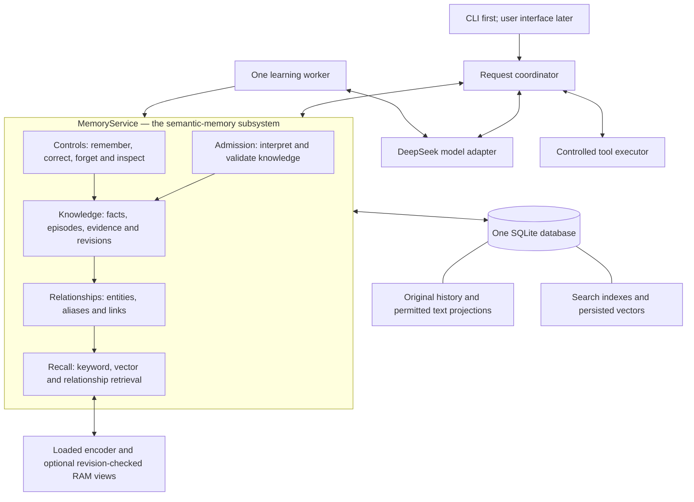

# Hey Kivi — consolidated architecture and project plan

Updated: 6 September 2026. Document revision: **1.2, portable documentation consolidation**. Runtime contracts unchanged from v1.1. Technical baseline: the reviewed v1 memory design. Status: **ready for product refinement and implementation; application not built**.

This is the governing technical reference for continuing the Golden Goose project; start at [README.md](README.md) for repository navigation. It consolidates the decisions, explanations, constraints and unresolved choices from this conversation, the assignment brief, and the saved research. It supersedes older planning notes where they differ. The consolidated [research](RESEARCH.md) supports the decisions; the [build plan](BUILD_PLAN.md) holds delivery and evaluation details. A finalized starting contract is not a claim that the system is optimal or already works.

**Status language:** “user choice” records an explicit preference; “baseline” is our current engineering plan; “candidate/proposed” needs validation or a product decision; “implemented” is reserved for code that exists. At this point, only a research-only SQLite contract probe exists. The product CLI, migrations, corpus, model integration, semantic evaluation and final interface do not exist yet.

**Reading route:** product and scope in section 0; tech stack in section 2; categories and storage in sections 3–4; input-to-output behavior in sections 6–9; caching in section 10; import/configuration/tools in section 11; evaluation in section 12; submission and next decisions in sections 15–17. Sections 12–17 retain stable reference points for the diagrams while detailed evaluation, delivery and research now live in BUILD_PLAN.md and RESEARCH.md.

## 0. Product intent, assignment scope and user behavior

### 0.1 What we are building and why

The selected assignment is **Golden Goose**, with **semantic memory for Hey Kivi** as the central engineering problem. The separate backend/phonetic-memory task is outside this build. No remaining deadline or eligibility for other hiring tracks is established here.

The recurring need expressed in the conversation is to recover useful past information without repeating or manually searching it, then use that information in the current request. The proposed abilities are:

| Ability | Ordinary request | What makes it useful |
|---|---|---|
| Recover | “What did I promise to send Riya?” | Finds evidence even when the user does not remember the original wording |
| Connect and understand changes | “What changed about our Jaipur plan?” | Combines records while separating earlier plans, current information and unresolved questions |
| Apply relevant context | “Prepare a short checklist using our budget and preferences.” | Turns recall into a useful answer or draft |
| Inspect and control, across all three | “Where did that come from?” / “That changed.” / “Forget it.” | Makes assistance understandable and correctable |

“Best memory,” low latency, good architecture and an attractive interface are quality goals. The first concrete user journey still needs to be selected and refined. The examples here explain technical behavior; they are not the applicant's Part One positioning statement or vision.

An **ability** is an outcome for the person; a **tool** is an executable operation; a **skill** is a reusable way to combine operations. Summarizing, comparing and drafting can be model behavior over retrieved evidence. They do not require three separate tools, a plugin marketplace, a roles hierarchy or a separate skills framework.

### 0.2 Kivi, Sarvam and the two modes

Sarvam is the company; Kivi is its voice-first computing product. The assignment describes regular dictation and direct Hey Kivi requests. Our submission is a separate working demonstration of the chosen memory experience, with its own backend and interface.

| Boundary | Regular dictation | Hey Kivi in this project |
|---|---|---|
| User intention | Write what the person says | Understand a request and help complete it |
| Personalization | Names/terminology, spelling, style and formatting | Relevant history, preferences, decisions, episodes and constraints |
| Memory role | Can supply historical observations for later learning | Retrieves and applies relevant understanding |
| Content behavior | Preserve intended content; do not insert unsolicited personal history | Answer, explain, prepare a draft or execute an authorized implemented tool |

Phonetic memory concerns how personal words should be recognized/written. Semantic memory concerns durable meaning and context. We are not implementing a phonetic-learning or speech-recognition pipeline in this scope. Raw ASR and formatted text are inputs to our history system; their difference alone does not prove a preferred spelling or a personal fact.

The brief's long-term direction permits dictation to become a tool inside Hey Kivi. It does not require us to recreate the entire current Kivi product. Public sources reviewed earlier showed dictation, vocabulary/style behavior and selected-text assistance. A native app walkthrough and a built-in chat/project workspace were **not verified**. Our memory design does not depend on such a workspace existing. Application name is not project identity. [Kivi public product page](https://heykivi.ai/)

### 0.3 What the assignment actually requires

The authoritative source is the [Golden Goose brief](reference/Kivi_Golden_Goose_Task_Final.pdf), pages 2–7. The user's learning notes PDF was reviewed against it and is not a replacement specification.

- Part One asks for the applicant's independently formed and written position, at most 100 words, and vision, at most 600 words, preserved before Part Two. It explicitly excludes generative AI from arriving at or writing that position. Completion of those documents has not been established here. This AI-assisted technical plan must not be represented as independently authored Part One work, and prior AI use must be described honestly.
- Part Two requires one real end-to-end product with a normal-user interface and backend. **CLI first is our development sequence; CLI alone is not the final submission.** A notebook, static mockup or architectural proposal is insufficient.
- No speech recognition or production Kivi integration is required. Import/replay text records containing raw ASR output, formatted output and available metadata. A typed Hey Kivi question is sufficient input.
- Create or obtain **approximately 500 history records**, then evaluate the complete pipeline. This is not a requirement for 500 test cases. Reviewers later import a separate approximately 500-record corpus from one user.
- Questions may ask anything reasonably stated in or derivable from that history, including multiple-record and temporal reasoning. Narrow tool scope does not justify hard-coding a narrow list of answerable questions.
- Missing metadata, languages, project IDs and exact future evaluator questions are unknown. Preserve missingness. English/Hindi/Hinglish coverage is our proposed test scope, not a guaranteed hidden-corpus format.
- A local web/desktop application is acceptable. Deployment and Docker are optional. The exact clean-checkout review path and generated results are required; section 15 lists the deliverables.

The proposed review arrangement is a local application/database connected to the hosted model API. Local storage does not mean offline model processing: eligible context is sent to the configured provider. One LLM key can be enough when embeddings run locally; account quota, prices and endpoint support must be checked during development.

### 0.4 Personalization, uncertainty and user control

The person should not have to classify memories, approve every extraction, merge graph nodes or maintain technical settings. Kivi organizes routinely; the person can inspect, correct, override and forget through ordinary language and simple controls. A developer inspection view is an additional review surface.

Current explicit instructions take precedence over applicable remembered preferences for this request. Using an old preference must not silently make it a new universal rule. A retrieved memory is used only when it helps the current task; it need not be announced. For example, a brevity preference can shape an answer without a personal callback.

| Situation | Proposed user-facing behavior |
|---|---|
| Enough evidence | Answer directly and make sources inspectable |
| Uncertain detail is unnecessary | Omit that detail and complete the supported portion |
| Two interpretations are useful to show | Explain the alternatives; a reversible draft may use a clearly labeled assumption |
| Missing detail materially changes the answer | Ask one focused question and give a supported partial answer when possible |
| Action lacks a material recipient, path, time or authority | Prepare what can be prepared; hold the dependent effect |
| History does not support an answer | Explain what is unknown; do not invent an answer |
| User skips clarification | Preserve uncertainty and take the supported fallback; skipping is not confirmation |

Background learning does not interrupt the user for every ambiguity. Preserve unresolved mentions and revisit them when a request needs the distinction. A model's self-reported confidence percentage is not a calibrated decision threshold. [Clarification research](https://aclanthology.org/2025.findings-naacl.306/)

Useful boundary examples from the discussion:

- “I visited Paris” supports a visit, not enjoyment, a year, a preference for France or an intention to return.
- “I want to visit Paris” is an intention; “my sister visited Paris” concerns the sister; a fictional draft is not a personal event.
- A postponed trip does not automatically prove an associated meeting was rescheduled. A manager's identity does not automatically establish who must review an unrelated document.
- Remembering a document's location does not establish access to its contents. An old “send this” dictation is historical evidence, not current execution authority.

Exact onboarding language, retention/no-personalization controls and which of these behaviors lead the final UI remain product-refinement work. The technical correction/forgetting boundaries below are already part of the baseline.

## 1. Where semantic memory is

**Semantic memory is the `MemoryService` subsystem and its durable knowledge records. SQLite is its initial storage engine.** It is a separate logical component inside the application, not a mandatory separate server or database.



The model interprets language. The memory service preserves and retrieves attributed knowledge. The coordinator controls request order. The tool executor performs permitted effects and records observations. A table, graph, map and vector are compatible representations with different jobs:

| Representation | Use in v1 |
|---|---|
| Relational tables | Durable sources, memories, evidence, controls, jobs and operation outcomes |
| Graph | Supported entity-to-entity links stored in tables; bounded traversal |
| Map/dictionary | Optional fast lookup by known ID/key during a running process; reconstructed from the database |
| Vectors | Meaning-based retrieval candidates derived from permitted text; stored in SQLite and scored locally |
| Working context | The current request, relevant conversation and retrieved evidence assembled for one run |
| Cache | Reusable computation with explicit validity rules; never the sole copy of knowledge |

This boundary follows the distinction between memory content and retrieval technique; semantic memory is not synonymous with semantic search. [LangChain memory concepts](https://docs.langchain.com/oss/python/concepts/memory)

## 2. Locked starting choices and measured alternatives

“Locked” means the current starting choice, subject to an explicit evidence-backed revision. It does not mean installed, benchmarked or impossible to change.

| Layer | Technology / approach | Decision status |
|---|---|---|
| Application language | Python; 3.12 is the available development-runtime family | Baseline; packaged runtime/version pin still needed |
| Request orchestration | Small custom coordinator, `MemoryService`, one durable worker and tool registry | Baseline; no full agent framework selected |
| Durable storage | SQLite through standard-library `sqlite3`, parameterized SQL and versioned migrations | Baseline; product schema/migrations not implemented |
| Exact-text search | SQLite FTS5 | Baseline; available in the research runtime |
| Meaning-based search | `sentence-transformers` + local embeddings + NumPy exact scoring | Planned separable extension; benchmark before default use |
| Embedding model | `intfloat/multilingual-e5-small`; compare `BAAI/bge-m3` only if useful | Candidates; no local accuracy/speed result yet |
| Language model | NVIDIA-hosted DeepSeek via a configurable adapter | User choice of provider/model family; exact model ID and behavior pending |
| Model/API client | HTTPX, with explicit timeouts, bounded retries and usage capture | Baseline |
| Data and model-output contracts | Pydantic plus application validation | Baseline; schema validation does not establish factual truth |
| CLI / persistent session | Standard-library `argparse` and a REPL | Baseline; CLI not yet written |
| Relationships | Entity/alias/edge tables in SQLite | Baseline representation; bounded expansion measured separately |
| Reuse / cache | Persist document vectors; retain loaded encoder; optional checked RAM views | Baseline policy; answer/result caching disabled initially |
| Tool connectivity | Narrow local tool adapter first; MCP adapter when a chosen use case needs it | Local artifact is the first proposed effect; MCP integration deferred |
| Evaluation | Custom corpus replay, evidence/rubric scoring, metrics and integrity checks | Planned; product test runner/library not selected |
| Final UI and HTTP/application adapter | Usable web or desktop client calling the same core | Required later; frameworks **not selected** |
| Packaging and review | Reproducible local setup with hosted LLM access | Proposed primary arrangement; Docker/hosting optional |

FastAPI, React, pytest, Redis, Neo4j and a hosted memory framework are not silently implied dependencies. The final UI framework and API adapter will be selected with the user journey; adding them must not create a second memory implementation.

Start with one Python application process, one SQLite file on local storage, and one worker. Use Python `sqlite3`, FTS5, Pydantic for validated contracts, HTTPX for the provider adapter, and standard `argparse` for the first CLI. Dense retrieval is a separable feature using `sentence-transformers`, a pinned multilingual encoder and NumPy exact scoring. E5-small is the first encoder candidate, with BGE-M3 a larger comparator. Pin exact dependency/model revisions during development after compatibility checks; these libraries are not all installed yet. [Pydantic validation](https://docs.pydantic.dev/latest/), [HTTPX timeouts](https://www.python-httpx.org/timeouts/), [E5-small](https://huggingface.co/intfloat/multilingual-e5-small)

Use NVIDIA-hosted DeepSeek behind a provider interface; credentials arrive during product development. Verify actual model name, context length, structured-output behavior, reasoning-token limits and tool support. Endpoint compatibility does not guarantee all features. Keys stay outside memory and traces.

Retain full-history and source-only retrieval as real baselines. Start implementing with source storage and lexical retrieval; selectively add typed memory and vectors. The semantic service includes controls, provenance and durable interpretation even if a simple source route wins some query classes.

Do not add a graph server, dedicated vector server, Redis, autonomous reflection, recursive summary tree or workflow platform in v1. Reconsider PostgreSQL/pgvector for multi-host or substantial concurrent-writing requirements; a graph engine for a measured traversal limitation; and approximate vector indexing for a measured exact-scan bottleneck. SQLite supports graph queries and many readers with one writer. A future database migration must revisit isolation/retry contracts. [SQLite use cases](https://sqlite.org/whentouse.html), [SQL graph traversal](https://sqlite.org/lang_with.html), [pgvector](https://github.com/pgvector/pgvector)

## 3. Categorization without disconnected silos

Every memory has independent axes. The model cannot infer scope or authority from a category alone.

| Axis | Values/contract |
|---|---|
| Memory form | Semantic knowledge, episodic experience, or a user-authorized reusable procedure |
| Content category | One primary label from the registry below; optional secondary labels |
| Subject and attribution | Who the claim concerns, who stated it, and whether it reports a user, third party or tool observation |
| Derivation | Direct attributed statement, tool observation, inference or summary; derived items retain dependencies and are not independent corroboration |
| Modality and polarity | Separate actuality/intention/commitment, conditional context and positive/negative proposition; preserve nested attribution rather than forcing everything into one label |
| Topic | Overlapping labels such as travel, family and work; not a retrieval access boundary |
| Scope | Person, project, trip, task, conversation or time-limited applicability; missing scope stays unresolved |
| Time | Event/validity time, source/capture time and availability/import time remain distinct |
| Evidence and lifecycle | Supporting exact spans; active, disputed, superseded, excluded; revision history |

The twelve categories are **labels on records in shared memory tables**. They are not twelve databases, twelve required tables or twelve isolated search routes. A single message can support multiple atomic memories, each with one primary category and optional secondary labels.

| # | Category | Contents / example | Boundary to preserve |
|---|---|---|---|
| 1 | Entities, attributes and stated capabilities | People, organizations, equipment, location, skills: “I use Windows.” | A claimed capability is attributed; the system has not independently tested it |
| 2 | Relationships and roles | Family, teams, ownership and responsibilities: “Riya is my sister.” | A shared name does not identify a person; roles apply within supported scope |
| 3 | Preferences and priorities | Likes, dislikes, response style, stated tradeoffs: “I prefer short updates.” | Preserve preference strength and context; do not silently turn a preference into a hard requirement |
| 4 | Constraints and requirements | Budgets, limits, necessary conditions: “Total hotel budget is INR 6,000.” | Preserve units and trip scope; total is not per night |
| 5 | Routines and recurring patterns | Usual activities or timing: “I review expenses on Sundays.” | A few observed instances do not prove a routine or an automatic reminder |
| 6 | Goals and desired outcomes | Aspirations or intended outcomes: “I want to learn Python.” | A goal is not a scheduled task or a promise |
| 7 | Plans, tasks and commitments | Tentative plans, intended actions, assignments, promises, with distinct subtypes | “Might visit,” “plan to visit” and “promised to book” do not establish completion |
| 8 | Decisions and explicitly stated reasons | Chosen option and supplied rationale: “We chose SQLite for local setup.” | Do not invent reasons or treat an unaccepted suggestion as a decision |
| 9 | Progress, blockers and open issues | Work state, dependencies, pending questions | A task being completed is distinct from a memory being superseded |
| 10 | Attributed beliefs, ideas and hypotheses | “Riya suspects the deadline will change.” | Record who believes what; belief is not confirmation of its proposition |
| 11 | Personal vocabulary and concepts | “Phoenix means our migration project.” | Meaning/reference resolution differs from phonetic spelling correction |
| 12 | Resources and references | Files, links, documents, useful artifacts and locations | A remembered reference does not establish current contents or permission to open it |

The registry and predicate rules are versioned application policy. The LLM may select categories and suggest overlapping topics such as travel/work/family. It may not rewrite the schema, SQL, policy or permissions. Optional secondary-label storage can be normalized or use validated JSON; that physical encoding is a migration-level choice, not twelve separate stores. Extend the registry only for a demonstrated recurring need; unfamiliar permitted text stays searchable without forced classification.

These are overlapping product labels, not a scientifically exhaustive partition. “Facts” is an umbrella. An attributed belief is knowledge that someone holds a belief, not proof that its proposition is true. A date does not automatically make a memory episodic. Unclassified permitted source material remains searchable. Categories are extraction/browsing aids; the system never routes a question exclusively to one category.

For example, a source stating “For the Jaipur trip, our total hotel budget is INR 6,000” supports a semantic constraint with trip scope, currency INR and total-budget meaning. It does not establish a nightly budget or a general spending limit. Represent the amount structurally while retaining the original phrase and evidence. A procedural instruction mentioned inside a document remains document content unless the user actually authorizes it as Kivi behavior.

Semantic knowledge, episodic experiences and authorized reusable procedures are independent **memory forms**. An episode may be an ordinary meeting, visit or attempted task. Working memory is the temporary context for the current request. The assignment uses semantic memory broadly enough to discuss factual, episodic and preference-level understanding; our schema retains the distinctions. Topics and recency do not form a mandatory hierarchy or a retrieval access boundary. [CoALA memory framework](https://arxiv.org/html/2309.02427v3#S4.SS1)

## 4. Durable schema and authority

The tables below are a logical implementation contract, not executed SQL DDL. Field nullability, check constraints, physical indexes, supported predicate definitions and exact migration files still need implementation and tests. Their authority, evidence, revision and scope rules must be preserved during that work.

All primary/foreign keys that cross user data include trusted `user_id`. User scope is supplied by the application, never the model. IDs are opaque. Use parameterized SQL. Enable foreign keys on every connection. Revisions are logical integers; they are not timestamps.

| Table/group | Required logical fields and constraints |
|---|---|
| `owner_state` | `user_id` PK; `knowledge_rev`, `index_rev`, `publication_seq` |
| `record_revisions`, `record_heads` | Composite key `(user_id, record_id, revision)`; role/origin, kind, exact raw/formatted fields or message text, source metadata, availability, visibility, content digest. A head pointer defines the current source revision; historical access explicitly selects a permitted revision. |
| `memory_revisions` | Composite key `(user_id, memory_id, revision)`; form/category, subject or unresolved mention, speaker/reporter/belief-holder attribution, derivation/dependencies, predicate, one typed object/value with units, scope, modality, polarity/condition, qualified time, assertion state, prior-revision links |
| `memory_heads` | Current revision pointer per memory identity; current does not mean universally true or applicable |
| `evidence` | Composite FKs to exact memory and source revisions; field, start/end offsets, support/contradiction role |
| `entities`, `aliases`, identity decisions, `edges` | User-scoped identities; alias and identity decisions retain source/memory support and revisions. Edges reference supporting memory revisions and preserve attribution, modality, polarity, time and scope. A shared alias alone does not merge identities. |
| `exclusions`, permitted projections | Targeted source/field/spans or broader explicitly selected scope; revision and allowed-text representation/mapping |
| `search_documents`, FTS5, `embeddings` | Subject revision, permitted-projection digest, encoder/config version, vector dimension/normalization, readiness. Only current allowed representations are eligible. |
| `jobs`, `memory_decisions` | Stage/input/config identity; held/queued/running/terminal state, attempt fencing token, expected revisions, candidate decisions and concise reasons |
| `runs`, `run_attempts`, `operations`, `responses` | Logical request key/digest, active attempt and run revision/status, retained attempt outcomes, exact effect arguments/authority, observed receipts, answer dependencies and acceptance sequence |

**Storage example.** One input says: “Riya is my sister. For our Jaipur trip, the total hotel budget is INR 6,000. For this trip, I prefer quiet hotels.” Store that original once, then accept separate supported assertions:

| Illustrative memory | Primary category | Typed meaning and scope | Evidence |
|---|---|---|---|
| M1 | Relationships and roles | User has sister Riya | Exact relationship phrase in the source |
| M2 | Constraints and requirements | Jaipur trip: total hotel budget, amount 6000, currency INR | Exact budget phrase in the source |
| M3 | Preferences and priorities | Quiet hotel preferred for this trip | Exact preference phrase in the source |

These are rows/revisions in the same memory store. Supported entity links connect the records; search documents and vectors help find them. The model sees a relevant evidence bundle, not unrestricted database access. M1–M3 are illustrative IDs, not existing data. The ambiguous word “our” does not itself establish that Riya is a trip participant.

Evidence offsets use zero-based Unicode code-point positions, end-exclusive, into the exact named original field. Normalization/transliteration/embedding chunks need mappings; their offsets cannot silently replace original offsets. Raw ASR and formatted text are paired representations of one observation, not independent corroboration. Preserve a material disagreement rather than selecting the more fluent version.

Ordinary source retrieval uses `record_heads` and the current permitted projection. An explicit historical revision or temporal replay must still pass today's exclusions and the evaluation's availability cutoff. Older source revisions cannot accidentally appear as extra corroborating records. Alias/identity support disappearing invalidates the decision and its dependent projections; rebuild conservatively from surviving evidence rather than keeping an irreversible merged identity.

Time has an original phrase, reference time/timezone when available, precision, and each interval bound marked `known`, `unknown` or `open`. A missing/unknown endpoint is not evidence of unrestricted validity. Task status such as completed/cancelled is a typed property distinct from assertion status such as active/superseded. A completed task can be a valid active assertion.

Use a small versioned predicate registry with subject/object types, units and cardinality within explicit scope and time. For example, a trip's total hotel budget can be single-valued for that trip and interval; preferences can be multi-valued. A second value becomes a replacement only when the supported change/correction establishes matching scope and temporal meaning. Otherwise retain alternatives/conflict. Unknown predicates/scopes do not trigger automatic overwrite. Keep the original statement alongside typed values.

For “Riya believes Ajay does not manage Project X,” preserve the reported belief holder and negative proposition. Do not project an unqualified positive management edge. Facts involving several participants may use an event entity with participant roles. Similarity/LLM-suggested associations, if later retained, are explicitly discovery hints and cannot serve as evidence-backed factual edges.

Original inputs and accepted user controls are durable evidence of what was expressed. Accepted memory interpretations are also retained and versioned: re-running an LLM need not reproduce them. Edges are projections of supported assertions. Search representations are rebuildable. Assistant output is conversation history, not independent proof of personal events. Tool evidence establishes what was observed at that operation/time, not arbitrary personal truths or fresh permission.

`knowledge_rev` advances whenever eligible evidence, admitted knowledge or controls change. `index_rev` advances when a ready search representation changes. `publication_seq` orders committed controls and accepted responses. Ordinary assistant-output logging does not automatically change knowledge. Per-source and per-memory revisions localize updates; a coarse knowledge revision provides a conservative response freshness check.

An ordinary correction can preserve source/history and supersede a current interpretation. A genuine real-world change and correction of an earlier mistake have different temporal meaning. Do not resolve ambiguous changes solely from last import time or embedding similarity. Multi-valued relationships/preferences may coexist; avoid a global uniqueness rule that forces one value per category.

## 5. One permitted-text boundary

Every model-facing history read uses `read_evidence`/`eligible_text`: lexical search results, vector candidate expansion, full-history baselines, source inspection, neighboring context, extraction and summaries. Raw-table access is not exposed as an agent tool.

The boundary checks trusted scope, source visibility/revision, exclusions and supported time constraints. It masks/omits excluded spans and returns a mapping to surviving original spans. If safe partial reconstruction is unavailable, exclude the entire affected chunk/record until rebuilt. Never use its old embedding to recover excluded meaning.

For live requests, the original source begins as `turn_private`: only the current run can use it. Its learning job is held. Before a forget is applied, the current run may read its current input; after controls, even private-current reads apply exclusions. A validated disposition releases only the surviving projection for general history/learning, never a fresh copy of raw text. A forget request repeating the targeted information must not become a new eligible source of it. Failed or unresolved control handling leaves learning held rather than silently promoting the source.

`forget` blocks future memory/model use of the selected information and known supporting spans; disclose whether original history is retained. `delete_source` removes the specified in-application source content and affected derivatives. Rebuild mixed-source memories only from surviving permitted evidence. Purge or suppress dependent prompts, candidate quotes, aliases, internal artifacts and retained answer copies within the selected boundary. Operation replay and `get_run` use the current projection too. User-owned exports, source files, backups and provider retention are separate boundaries; do not silently edit unrelated files or promise recognition of arbitrary future paraphrases.

## 6. MemoryService API

These names define the implementation contract; they are not existing commands or functions.

| Method | Input | Output |
|---|---|---|
| `import_history` | Trusted context, source envelope, stable import key | Source receipt and per-stage readiness; no external execution |
| `accept_turn` | Trusted context, request key, exact input | Run ID/revision; private source; held learning job |
| `retrieve` | Query specification, scope, time, evidence budget | Candidates, original spans, completeness/readiness and store-issued freshness token |
| `read_evidence` | Source refs/spans and trusted context | Current permitted text plus original-span mapping |
| `inspect_memory` | Memory ID/revision | Interpretation, evidence, decisions, history and control state |
| `apply_controls` | Ordered compatible controls, operation key, target revisions | Code-issued committed/no-op/conflict/needs-input/rejected/failed receipt |
| `delete_source` | Explicit source-deletion instruction, selected source IDs/revisions, trusted context and operation key | Use-block receipt, exact deletion scope, source-retention/purge status and affected dependencies; implemented through the same validated control transaction |
| `admit_candidates` | Job/attempt token, candidates, captured dependencies | Per-candidate decisions and committed memory/index-job revisions |
| `process_pending` | Bounded stage/source set and configuration | Durable progress, watermark, pending/no-op/failed counts |
| `get_run`, `resume_run`, `cancel_run` | Run ID/revision and any new authorized input | Current eligible result, actual operation state or cancellation intent |
| `accept_response` | Buffered answer, dependencies, actual action receipts | Committed answer/sequence or stale/cancelled/rejected outcome |

An idempotency key identifies one logical request/effect. Same key plus identical canonical payload returns its current receipt; same key plus a changed payload returns conflict. The application assigns operation IDs and freshness tokens. The model cannot invent success receipts, authoritative versions or a different user scope.

## 7. Model contract and exact request path

The provider adapter validates one versioned proposal:

```text
TurnProposal(version=1)
  controls: list[Remember | Correct | Forget | DeleteSource]
  next: Answer | Retrieve | ProposeAction | Clarify | Abstain

Each control: target references, scoped change, current-request evidence,
              change-vs-correction meaning where applicable.
Answer: provisional text, personal-claim evidence references, status.
Retrieve: registered read operation, bounded arguments, missing evidence.
ProposeAction: registered tool, proposed arguments, supporting references.
Clarify: missing field, question, permitted partial fallback.
```

`next` is one discriminated choice. The model cannot declare a tool succeeded or a memory was committed. The service produces receipts after actual state transitions. Validate syntax, unknown fields/operations, ownership, references and legal transitions. Quote/span validity does not prove factual entailment or detect a control the model failed to propose; those need semantic evaluation. Provide explicit correction/forget CLI/UI controls as a less ambiguous path.

1. **Accept:** persist the run, private current source and held learning job. Explicit CLI controls with IDs can bypass language interpretation.
2. **Read:** gather a coherent snapshot from both memory and original-source routes. Add the current input and relevant recent conversation. Close read transactions before model calls.
3. **Interpret:** make the first answer-model call. No mandatory separate classifier and no comprehensive extraction before every answer.
4. **Control:** validate detected controls and apply a compatible batch atomically. If unresolved, conflicting or failed, block dependent effects and any saved-success claim. Independent drafting can use current input with an honest unsaved/partial status.
5. **Release permitted learning:** commit the current source's allowed projection and release its job only after controls resolve. If forgotten text is mentioned in the request, it remains excluded. Current input was already available privately to this run. The service returns a disposition receipt with knowledge revision before/after and the promoted projection digest. It may rebase the answer's freshness token only if the before revision exactly matches the captured token, the sole change is promotion of text already present in that run's context, its permitted digest is unchanged, and no control or intervening write changed meaning. Recheck the after revision at publication. Any unrelated change before/after release or altered projection requires normal refresh. The model cannot request this exception.
6. **Continue:** if changed evidence invalidates the provisional result, refresh retrieval and regenerate. Otherwise process its answer/read/action choice. Repeated controls return their existing receipt. Tool observations re-enter the model as observations.
7. **Publish:** buffer the final answer. In a short transaction, check fresh knowledge/run/permission state, accept the output, assign sequence and persist the terminal run outcome together. A changed knowledge revision can represent new contradictory evidence even when cited rows are unchanged; refresh under a bounded retry policy. No second raw content copy is written after acceptance.
8. **Deliver/replay:** return the committed result through the ordered output path. Retrieval on reconnect or idempotent replay must obey current suppression. Acceptance is ordered against controls; it does not make network delivery atomic or retract previously received bytes.

Initial circuit breakers: four answer-model attempts including repair/retries, six follow-up read operations beyond initial retrieval, one external effect, and a 30-second ordinary-request deadline. One ordinary supported answer targets one model call. Permit at most one eligible transient retry per call within the total budget. On exhaustion, return an observed partial/error status; do not make an unbounded final attempt. These limits are development defaults, not endpoint guarantees.

### 7.1 Two entry paths, one memory service

```text
Historical record: raw ASR + formatted text + available metadata
  -> validated import and original-source persistence
  -> permitted source search becomes available
  -> durable worker proposes / validates / admits useful memories
  -> evidence, supported links and search representations become ready

Current typed Hey Kivi request
  -> private input + held learning job
  -> permitted history/memory retrieval + current input
  -> model proposal
  -> application commits controls / resolves allowed source release
  -> further retrieval or authorized tool effect only if needed
  -> freshness check + response acceptance
  -> output text, sources and actual artifact/outcome
```

Imported history is not a live instruction. A current input is available to its own answer before background extraction completes. Ordinary learning stays off the answer's critical path, but its costs are still recorded. An explicit “remember/correct/forget” must succeed before Kivi claims that it was saved or removed.

### 7.2 Illustrative complete journey and failures

1. Import sources establishing the Jaipur trip's total hotel budget as INR 6,000 and the user's trip-specific quiet-hotel preference. Inspect the original sources and accepted memories.
2. Ask for a hotel-selection checklist. Retrieve both constraints/preferences with evidence and prepare a useful draft; do not invent actual hotel availability or a completed booking.
3. Say “Change the total hotel budget for that Jaipur trip to INR 8,000.” Resolve the same trip, commit the supported change, preserve the earlier value as historical, and acknowledge only after commit.
4. Ask the current budget and the earlier budget. Answer INR 8,000 and INR 6,000 respectively, with their sources and time/status qualifications.
5. Optionally request saving the checklist to a designated local path. Use current authority, verify the resulting artifact and report its observed status. Memory saving and a filesystem effect are separate outcomes; one can succeed while the other fails.
6. Inspect why the budget affected the answer, then request forgetting that budget. The selected information and known supporting spans stop being used through memories, original-source fallback, stale jobs, indexes and retained answer replay. Distinguish this from deleting the original source itself.

If “that trip” matches multiple trips, preserve the ambiguity and ask only for the distinction needed. If persistence fails, an independent draft can still use the current message with an explicit unsaved status. If an effect times out after dispatch, show unknown outcome and reconcile; do not blindly duplicate it. This journey is a contract illustration, not a prepared-only demo or finalized product narrative.

## 8. Atomic operations and durable recovery

Atomic means the related database changes commit together or none do. It does not mean the whole request, model API, database and file system share one transaction.

| Operation | Changes checked/committed together |
|---|---|
| Accept input | Request-key/digest check; source/run identity; visibility; held or queued job |
| Apply controls | Validate the complete compatible batch and expected targets; memory revisions/heads; exclusions; permitted-source projection; affected indexes/links; receipt and knowledge revision |
| Resolve live-source disposition | Allowed remaining source text, readiness, released/remaining held job and knowledge revision; combine with controls where possible |
| Admit background memories | Current job attempt/lease and captured source/knowledge/target revisions; candidate decisions, memory/evidence/edge/FTS changes; follow-up vector jobs |
| Complete vector work | Current allowed projection/encoder/revision; vector row and job outcome; index revision |
| Prepare effect | Exact target/arguments, authorization reference, operation key and expected target version |
| Admit dispatch | Recheck applicable controls/authority; compare-and-set ready to dispatched; record attempt identity |
| Observe effect | Actual receipt/status, operation state and permitted tool observation |
| Accept response | Fresh knowledge/run/cancellation checks, answer dependencies, response content, terminal run status and publication sequence |

Use short transactions and bounded busy/retry behavior. No model call, embedding computation or external tool effect happens inside a DB transaction. A worker reclaim increments an attempt token; a delayed prior attempt cannot commit. Enqueue jobs in the same transaction as the state requiring them. Do not describe retried external calls as exactly-once execution. [SQLite isolation](https://sqlite.org/isolation.html), [Kleppmann on dual writes](https://martin.kleppmann.com/2015/05/27/logs-for-data-infrastructure.html), [Temporal Activity execution](https://docs.temporal.io/activity-definition)

Keep states separate:

```text
Run: accepted -> running -> waiting_input -> running
     running -> completed | partial | failed | cancelled | outcome_unknown
     accepted/running/waiting_input -> cancelled when stoppage is established
Explicit resume of a failed attempt -> linked new attempt: accepted -> running
     prior attempt stays terminal; committed operation receipts stay authoritative

Learning: held -> queued -> running -> succeeded | no_op | excluded
          running -> retry_wait -> queued; exhausted -> failed
          stale completion -> discard or queue a new revision

Effect: proposed -> ready | waiting_approval | rejected
        waiting_approval -> ready only after matching authorization
        proposed/waiting_approval/ready -> cancelled | rejected
        ready -> dispatched -> succeeded | failed | unknown
        unknown -> reconciling -> succeeded | failed | unknown
```

Crash after a local commit: replay the receipt. Crash after external dispatch but before recording completion: preserve unknown outcome and reconcile. Cancellation after dispatch expresses intent, not guaranteed rollback. Deletion after response acceptance invalidates retained copies according to policy; already delivered text has a separate boundary.

`resume_run` after terminal failure creates a linked attempt under the logical request and atomically updates its active-attempt pointer; it does not rewrite the prior terminal attempt. The new attempt has an explicit fresh bounded call/deadline budget, while cumulative usage remains recorded. Reuse committed operation receipts and reconcile any unknown dispatched effect before further execution. Changed effect payloads need a new operation identity and fresh authority check. A waiting-input continuation retains its attempt's call budget; user-wait time is reported separately from active execution time.

FTS updates must be tested with actual `MATCH` queries. Enable WAL only on suitable local storage, use a runtime containing its documented fixes, and use SQLite's backup API for active databases. The available research runtime is Python 3.12.14 / SQLite 3.53.1 with FTS5; this does not establish the future packaged application's configuration. [SQLite WAL](https://sqlite.org/wal.html), [FTS5](https://sqlite.org/fts5.html), [backup API](https://sqlite.org/backup.html)

## 9. Learning and retrieval details

The learner works on permitted source units. Begin with individual short records and justified adjacent context. Batch coherent segments only when context/cost measurements justify it; never batch across unknown speaker/session boundaries or hold explicit user controls for a consolidation window. Distinguish successful empty extraction from a parse/provider failure. An unresolved name, date or pronoun remains unresolved; compression must not manufacture specificity.

Extract attributed candidates, retrieve related existing assertions, then validate and admit. Outcomes are add, supported change/correction, link independent evidence, duplicate/no-op, conflict/unresolved or rejection. Preserve conflicting history. Only explicit controls can request forgetting; ordinary model disagreement is not permission to erase original evidence.

Admission policy is versioned and inspectable. Preserve useful reported facts, preferences, plans, decisions and experiences when supported. Do not turn greetings, repetitions, boilerplate, fictional/quoted passages, assistant-generated drafts, ambiguous ASR differences or unsupported interpretations into unqualified user facts. A quotation can still be useful knowledge about who said what. Unknown attribution or time stays unknown; it is not fixed by rewriting a sentence more fluently. Deliberately skipping derived memory leaves permitted source retrieval available. The exact product policy for unusually sensitive data still needs a stated user experience rather than a blanket promise to remember everything.

Record prompt, admission-policy, category/predicate-registry, model, encoder, preprocessing and retrieval-configuration versions/hashes with jobs and evaluation manifests. Changes to accepted interpretations are explicit versioned operations, not silent consequences of loading a new prompt. Prompts instruct the model; code enforces scope, schemas, allowed operations and atomic transitions. Store concise evidence-linked decision reasons, not hidden chain-of-thought.

Retrieval starts with four candidate lists when dense is enabled: source lexical, source vector, memory lexical and memory vector. Prototype defaults are top 20 per list, reciprocal rank fusion with k=60, and at most 40 fused candidates before packing. Deduplicate source variants and overlapping evidence. These are tunable retrieval budgets, not optimum values or confidence thresholds. Graph expansion can add one supported hop with at most 20 entities/40 evidence references; retain a truncation indicator. Adjust only on development data. [Hybrid retrieval](https://www.anthropic.com/engineering/contextual-retrieval)

For direct recall, inspect original supporting spans. For multi-source questions, retrieve bridge evidence through links or a bounded further read. For counts, complete lists and change histories, use structured enumeration plus source fallback for extraction gaps; a top-k list cannot establish completeness. Page such reads (initially 100 records per page) through the same eligibility boundary and report incomplete coverage when limits prevent enumeration. Coherent late records and current corrections remain temporally distinguishable.

Start with a 4,096-token evidence budget including memory text, source excerpts and metadata. Preserve decisive spans during packing. Use the actual tokenizer and reserve model output/context overhead. E5 inputs use the model's documented prefixes and token limits. Exact vector scoring means no approximate-neighbor candidate loss under that function, not perfect semantic retrieval. Hindi/Hinglish, negation and names require their own tests. [Sentence-transformers semantic search](https://www.sbert.net/examples/sentence_transformer/applications/semantic-search/README.html)

Return an evidence bundle with source/memory revisions, scores, supported spans, conflicts, coverage/truncation, per-stage readiness and a store-issued freshness token. An answer's personal claims need permitted evidence. General world knowledge and external tool information remain distinguishable. Useful personalization can silently shape a response; merely mentioning a remembered fact is not a success metric.

## 10. Exact cache policy

| Layer | v1 policy | Validity/invalidation |
|---|---|---|
| Persisted document/memory embeddings | Enable with dense retrieval | User, record/memory revision, permitted-projection digest, encoder revision/preprocessing, dimension/normalization |
| Loaded encoder | Keep in RAM during a persistent process | Model configuration and process lifetime |
| RAM vector/map view | Optional optimization; retain correctness without it | User and index/knowledge revision as applicable; rebuild/swap coherently; recheck eligibility |
| Query-embedding cache | Off initially; possible bounded cache later | Exact actual encoder input, user, encoder/preprocessing revision; purge retained query text under controls |
| Retrieval-result cache | Off initially | Would need query interpretation/working context, user/scope, knowledge/index revisions, time and retrieval configuration |
| Exact or semantic answer cache | Off | Would also need instructions, evidence, model and tool/external dependencies |
| Provider prompt cache | No assumption of support | Verify actual NVIDIA capability, retention, billing and hit telemetry |

Storing embeddings in SQLite is precomputation/index persistence. Loading the encoder once avoids cold-start work. Those supply useful reuse without a cache of old final answers.

A cache inside SQLite can help if it avoids expensive computation; for example, a repeated query encoding can survive CLI restarts. It does not automatically improve an already cheap indexed DB lookup. Avoid turning every cache hit into a DB write for `last_used`. Measure net hit/miss/lookup/invalidation costs under realistic repetition. Relative-time questions can change without a knowledge mutation. TTL is insufficient for immediate correction/forget semantics. SQLite already has a page cache, distinct from cached model results. [SQLite page cache](https://sqlite.org/pragma.html#pragma_cache_size), [Huyen on cache types](https://huyenchip.com/2024/07/25/genai-platform.html#step-4-reduce-latency-with-cache)

## 11. Tools, CLI lifecycle and later interface

Use a small tool registry and application-validated arguments. Existing authorization is reused within scope; missing authority or material target details are resolved before dispatch. First effect: create/update a user-requested local artifact under a designated directory, with expected path/version and observable result. Do not automatically execute a remembered intention. An external read can disclose its query, so tool scope includes outgoing content.

MCP is an adapter protocol. Its tool annotations cannot independently grant authority, and negotiated task support cannot be assumed for every server. A timeout or expired remote task is not proof of no effect. Persist receipts and reconcile unknown outcomes before any retry that could duplicate work. [MCP tools](https://modelcontextprotocol.io/specification/2025-11-25/server/tools), [MCP tasks](https://modelcontextprotocol.io/specification/2025-11-25/basic/utilities/tasks)

Planned CLI surface: `init`, `import`, `process --resume`, `ask`, `chat`, `resume <run_id>`, `cancel <run_id>`, `inspect`, `correct`, `forget`, `delete-source`, `status`, `evaluate`, and `reset`. All call the same service contracts. `chat` is a persistent REPL that can retain the encoder and worker. In one-shot `ask`, input and pending jobs persist, but ordinary learning stops when the process exits; show pending status and use `process --resume` for eligible queued work. It reports held jobs separately and cannot resolve their control interpretation by extraction. `resume <run_id>` routes a failed/unresolved live turn back through the coordinator with any needed clarification; only its valid disposition releases learning. Explicit controls still commit synchronously. No invisible daemon is implied.

Proposed module layout, not yet created:

```text
kivi/
  cli.py                 # argparse client / persistent REPL
  coordinator.py         # request state and bounded proposal loop
  contracts.py           # Pydantic proposal/receipt/evidence contracts
  prompts/               # versioned extraction/answer policy; no authority from source text
  memory/
    service.py           # public memory operations
    admission.py         # extraction proposals and lifecycle decisions
    evidence.py          # one permitted-text projection boundary
    retrieval.py         # lexical/dense/link retrieval and packing
    controls.py          # remember/correct/forget
  storage/
    repository.py        # scoped parameterized SQL and atomic operations
    migrations/          # versioned schema changes
  models/
    language.py          # NVIDIA/DeepSeek adapter
    embeddings.py        # pinned local encoder
  jobs.py                # durable learning/index work
  tools.py               # narrow registry/adapters and effect ledger
  evaluation/            # replay, fixtures, rubrics, metrics
```

The final UI will call this service through an application boundary and provide evidence, controls, processing state and actual outcomes. Frontend choice and detailed user journeys follow this blueprint; CLI-only remains an intermediate milestone.

The first artifact tool should show its target and operation, validate a designated-directory boundary and expected existing version, and return the actual path/content digest or error. Use readback/reconciliation for an uncertain write. A remembered preference never grants filesystem, email or calendar authority. Calendar, email, browser/web search, reminders and general MCP connectors remain optional, use-case-driven extensions; no scheduler or external account integration is assumed.

### 11.1 Import and configuration contract to finalize in development

The baseline requires a documented, versioned import format that a reviewer can map their logs into. JSONL is the proposed first encoding. The following is a **draft logical envelope**, not an implemented parser contract:

| Field | Planned meaning |
|---|---|
| `schema_version` | Explicit format version |
| `record_id`, `revision` | Stable upstream identity/revision; generated importer mapping must be reproducible if absent |
| `raw_asr`, `formatted_text` | Exact paired text fields; preserve Unicode and material disagreement |
| `captured_at`, `timezone`, `available_at` | Optional supplied time context; distinguish capture and availability |
| `app`, `conversation_id`, `project_id` | Optional supplied scope/context; absence does not block unrelated recall |
| `metadata` | Original additional fields, kept as untrusted data |

Trusted user scope comes from the application/import invocation, not a model or arbitrary row field. Define required/null/malformed behavior in the actual import schema before corpus generation. The expected assignment pair should be validated; incomplete local stress fixtures need explicit handling, not invented text. Preserve distinct real events even if text is identical. Stable ID/revision plus payload governs repeat import; content hashes detect changes and do not define event identity alone. Account for every row as accepted, duplicate, pending or rejected with reason. Reimport must not silently bypass an exclusion or recreate a deleted source; define suppression/tombstone behavior and explicit restoration separately.

Proposed environment-variable names to preserve or explicitly revise when `.env.example` is implemented:

| Name | Purpose / status |
|---|---|
| `NVIDIA_API_KEY` | Secret supplied by the user during development, not in chat, source data, traces or Git |
| `KIVI_LLM_BASE_URL` | Configurable provider endpoint; verify the actual NVIDIA deployment |
| `KIVI_LLM_MODEL` | Exact verified model ID; not selected yet |
| `KIVI_DB_PATH` | Local application-owned SQLite path |
| `KIVI_EMBEDDING_MODEL` | Encoder identifier; pin a model revision in the run configuration |

Timeouts, output/reasoning limits, concurrency, retry ceilings, embedding settings and total usage budgets belong in versioned configuration. The actual SDK/request shape, structured-output support, context/tokenizer behavior, rates and account limits require a live preflight. No free/unlimited quota or provider caching is promised. No API key is needed to continue refining this plan.

Pin Python, package and model revisions during implementation, and record model-download size/startup needs in `RUN.md`. Compare a cold one-shot process with a warm REPL/service; their encoder costs differ. Exact install/start/reset commands must be tested against real code before they are documented as working commands.

## 12. Evaluation, review loops and stopping rule

The complete protocol is consolidated in [BUILD_PLAN.md](BUILD_PLAN.md): approximately 500 history records; 80 reviewed questions (30 development / 50 sealed); a separate 50-source extraction audit (20 / 30); narrative/template separation, availability cutoffs and no gold leakage. Compare permitted full history, source-only lexical/hybrid retrieval and typed memory with the same reader and fair evidence budgets.

It preserves proposed quality/integrity gates, multilingual slices, the two-finalist 320-reader-attempt budget, cold/warm latency and ingestion-plus-query cost accounting, product failure fixtures and submission evidence. These are **proposals, not achieved results**. Ratify targets before sealing; tune on development cases, freeze and evaluate. Change one justified component at a time; prefer the simpler route when added complexity has no measured benefit. The isolated probe is distinct from the required product integrity suite.

## 13. Research inspirations and why this is not a framework transplant

[RESEARCH.md](RESEARCH.md) consolidates the original competitor study, 15 research topics, three blueprint audits and three design reviews. It retains primary sources, dated repository observations, alternatives, limits and experiments. Source-backed temporal claims, durable evidence, typed admission, hybrid retrieval and bounded orchestration are mechanisms to evaluate; no framework or public leaderboard proves this product's quality.

The design deliberately preserves source search when extraction yields nothing, explicit failure versus no-op status, unresolved names/time, scoped controls and durable interpretations. Reusing a framework remains possible if it satisfies those contracts at lower engineering cost. Hosted and open-source behavior must be checked separately. Public book sections and primary papers were consulted; no claim is made to exhaustive market coverage or reading entire commercial books. Recheck mutable dependency/product details before adoption.

## 14. Completed review, validation and next boundary

Three independent researchers reviewed the integrated contracts and then checked the corrections. The closed findings include attribution/polarity in graph projections, unknown temporal bounds, scoped predicate cardinality, alias/identity provenance, current source heads, live-source promotion freshness, explicit source deletion, approval/cancellation transitions and linked retry attempts.

The [isolated SQLite probe](research/validation/atomic_memory_probe.py) uses actual in-memory SQL transactions, foreign keys and FTS5 triggers with controlled sequential interleavings. Initial ten checks passed. A new held-source-forget case failed; projection unification fixed it. An additional source-promotion/freshness case tested the controlled one-call exception. Final result, independently rerun by the primary agent: **12/12 passed**, Python 3.12.14 / SQLite 3.53.1. [Machine-readable results](research/validation/atomic_memory_results.json), [failure/fix review history](BUILD_PLAN.md).

The probe does not test real concurrency, disk-crash recovery, LLM interpretation, factual accuracy, graph/alias cleanup, MCP execution or performance. It is an executable design model, not the product or its production test suite. The future application must exercise the same contracts independently.

The next stage is user-point-of-view refinement: define the default experience for recalling changed information, preparing a useful personalized result, and inspecting/correcting/forgetting memory; specify ambiguity and partial-success behavior. Then implement the CLI against these contracts, starting with source import/inspection and a complete cited-answer path. Model credentials, endpoint/encoder validation, actual migrations and product tests belong to that development stage. The final assignment also needs the normal-user interface after the CLI milestone.

The earlier conversation consolidation added assignment-alignment, technical-contract and research-decision audits. They corrected missing submission/product context and an incorrect claim that the corpus existed. During the portable-repository handoff, the unchanged probe was rerun successfully (12/12) to check its documented invocation. No application or new model benchmark was built; this adds no evidence beyond the probe's stated scope.

## 15. Submission and reviewer completion checklist

See [BUILD_PLAN.md](BUILD_PLAN.md) for the complete assignment-to-deliverable checklist: independent Part One, a real normal-user UI/backend, approximately 500 source records, unfamiliar-corpus import, source-inspectable behavior and controls, reproducible evaluation/results, setup/run/reset commands, demo and actual AI-use disclosure. The original [assignment PDF](reference/Kivi_Golden_Goose_Task_Final.pdf) governs. A CLI, static diagram or this planning repository alone is not the final product.

## 16. Build order, open decisions and scope control

[BUILD_PLAN.md](BUILD_PLAN.md) is the single detailed milestone and open-decision register. Begin with one worthwhile journey and its ambiguity/change/forget/failure states; implement durable source import and retrieval, then one supported request with controls, selective learning, measured improvements, UI and reviewer setup. Build lifecycle fixtures alongside the affected behavior.

NVIDIA-hosted DeepSeek is the user's chosen provider/model family. Exact endpoint, UI/API framework, detailed admission/retention UX, physical schema/import contract, embedding default and measurable targets remain open. Defer additional databases, caches, recursive summaries, rerankers, reflection and broad integrations before cutting evidence coverage, correction/forgetting, useful behavior, evaluation or the final interface.

## 17. Conversation decision register and fresh-start handoff

Read [README.md](README.md), [AGENTS.md](AGENTS.md) and the relevant [build milestones](BUILD_PLAN.md) to continue on another machine or in a new chat. Current decisions: Golden Goose rather than the phonetic/backend task; one MemoryService over one SQLite database; twelve overlapping categories; imported paired history plus typed Hey Kivi requests; evidence-first source fallback; controlled live-input release; explicit controls before success claims; one bounded coordinator and worker; optional measured retrieval extensions.

Earlier six-category sketches, generic unversioned schema examples, immediate shared publication of live input, 60-question examples and superseded framework recommendations do not override these contracts. The original notes are recoverable from commit `3586cf9`; [consolidation provenance](reference/documentation-consolidation.json) records their new homes. Preserve explicit choices and correctness rules, and revise decisions only with a stated user benefit and testable tradeoff. The next evidence should come from a working journey, not restarting an unbounded research cycle.
