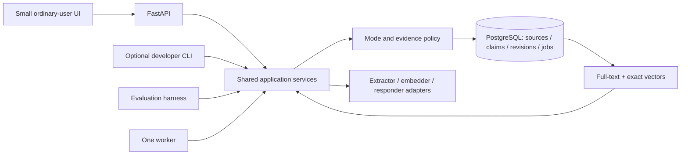

# Proposed memory architecture

Status: S03 infrastructure, S04 evidence/policy boundaries and S05 diagnostic import/inspection are implemented and checked; extraction, retrieval and complete lifecycle behavior below remain designs to implement and evaluate. Agreed behavior lives in [DECISIONS.md](DECISIONS.md), and [RUN.md](RUN.md) records actual evidence.

## One application, several entry points

The API, CLI and worker are adapters around the same operations: import, process, ask, inspect, correct, forget and evaluate. No client writes directly around policy. One Python image serves API, worker, CLI and tests. S03 Compose runs `db`, one-shot `migrate`, `api` and a `cli` tools profile; `compose.test.yaml` supplies a standalone test project. The minimal frontend is served by the existing FastAPI container at `/`; no separate frontend service is needed. `worker` remains later work. Users work in the browser; the CLI is optional for developers.

Run DB migrations once, wait for DB health and successful migrations, and use named volumes. Tests get a separate database and credentials with no access to the normal data volume. Compose startup order alone does not prove readiness; use health and completion conditions. [Docker guidance](https://docs.docker.com/compose/how-tos/startup-order/)

The initial review service binds to loopback and uses a server-controlled local user identity. Never trust a submitted `user_id` as authorization. Keep ownership checks and cross-user test fixtures even for a single-user demo. Public deployment would require an additional approved authentication/security pass.

S03 stores policy, source and job records; S04 adds owned exact passages, claim revisions and evidence links. API/CLI and future worker operations share `Service`, a backend-issued request context and the owner policy-row commit guard. S05 adds bounded JSONL import, paginated listing and exact source/job inspection. pgvector is installed, with no embeddings or search indexes. Full extraction, retrieval and lifecycle workflows below remain later work.

## Evidence representation

The assignment uses **semantic memory as a broad product term**: our planned scope includes facts, scoped preferences and useful episodes. In the narrower content taxonomy, semantic understanding means reusable facts/preferences, episodic understanding preserves reported happenings and their context, and procedural knowledge describes how to act. We defer **automatic procedural learning**, not episodic understanding. This is our scope choice; the brief does not mandate that deferral. [Brief locators and terminology sources](docs/visual-guide-references.md#assignment-brief)

History preserves original records and their support for derived understanding. Persistence describes lifetime independently of content kind, and these categories do not require separate databases. A reported event is not an independently verified action; ordinary reviewed code and prompts can guide behavior without learning procedures automatically.

| Logical record | Required information |
| --- | --- |
| Source observation | Stable user/import/source identity; raw and formatted variants; available capture/app metadata; version and content hash. Missing metadata stays unknown. |
| Passage | Source version and exact text offsets or a verified exact excerpt; Unicode offset convention documented. |
| Claim revision | Subject/entity, predicate, typed value, units, scope, attribution, negation, modality, temporal qualifiers and evidence links. |
| Claim state | Separate evidence status (reported, tentative, disputed) from lifecycle (active, superseded, corrected, excluded). |
| Relations / derivations | Evidence-backed supersedes, contradicts, conditional-on and source→claim→index dependencies. Graph edges can live in ordinary tables. |
| Policy / exclusions | Per-user revision plus minimal restrictions covering selected support, known duplicates and reimports. |
| Jobs / operation trace | Idempotency key, attempt, source/model/prompt revisions, selected evidence, stage timing, result/error category and actual outcome. |

Do not call a proposed, reported or inferred claim independently verified. Distinguish capture time, import/record time, event time and the period a claim applies. A launch date is not its claim's `valid_from`. Unknown effective times remain unknown. Newest ingestion must not automatically win. [Bitemporal history](https://martinfowler.com/articles/bitemporal-history.html), [W3C provenance](https://www.w3.org/TR/prov-overview/)

## Implemented S04 contract boundary

Source identity is owner + source key; each revision has a distinct source-row ID and one raw/formatted pair. Original text, nullable capture metadata and actual import time remain separate. New source writes require the expected current source/policy revision; previous revisions are preserved. The new provenance column defaults existing records to `unknown`, which cannot support a claim until a later explicit eligibility path exists.

Supporting passages identify source ID/revision, raw or formatted variant, zero-based half-open Unicode code-point offsets and the exact text. The service validates owned latest sources under the commit guard; relational foreign keys also enforce source/passage/claim ownership. Claim content is a validated JSONB value with typed subject/attribution labels, value and units, scope, uncertainty, negation, condition and explicit-precision time. Revision/lifecycle/owner fields and evidence links are relational. JSONB keeps the bounded contract readable without introducing an entity/search schema before its milestone.

Entity IDs remain null until a backend registry exists. Calendar dates are not coerced into instants; numeric/naive timestamps are rejected, and unknown event/effective times remain unknown. Tentative or conditional meaning is retained. An exact real passage establishes a structurally valid reference, not semantic entailment or independent truth.

Every implemented personal-store service operation gates Private before session creation. Current-input observation validation is pure and permitted in either mode. API/CLI errors expose only fixed categories; the supported Compose API/CLI have no persistent container logs. No content, prior context or activity is retained between validation calls. Mode is explicit per request; persistent mode preference, provider behavior and full controls are not implemented. The later UI foundation below adds transient page state and mode clearing. [Actual checks and limits](RUN.md#actual-s04-results)

## Implemented S05 import boundary

An import namespace and original record ID map reversibly to `import:<namespace>:<record_id>` in the existing owner-scoped source key. Each component is 1–96 ASCII letters/digits/dots/underscores/hyphens, starting with a letter or digit; case matters. Keep the namespace stable across exports/retries of the same source collection. Different namespaces or IDs mean different observations even when text matches. The key prefix is reserved from generic source writes. This uses the existing schema; S05 adds no migration or dependency.

The UTF-8 JSONL contract requires `record_id` and `raw_transcript`; `formatted_text` and `metadata` are optional/null. Metadata objects are retained, with an explicitly zoned `captured_at` copied to the typed capture-time field when supplied. Missing metadata remains null; an explicit empty object stays empty. Unknown top-level fields, generated-message role selectors, duplicate keys/IDs, invalid times and unsupported JSON/text fail closed. Caller-supplied dictations are the eligible source kind; the importer does not execute text or establish its truth. [Full limits and commands](RUN.md#s05-import-and-inspection)

Validate the whole bounded batch before SQL. Under the same owner policy lock as S04 writes, require the current policy revision, compare any existing observation and atomically insert all new sources and their pending ingestion jobs. Equal source fields/metadata return the same source/job IDs without changing timestamps, attempts or job status. JSON object order/numeric notation is immaterial; booleans differ from numbers. Any changed field under an existing identity returns `import_conflict` and writes nothing from that batch. Import cannot silently revise, correct, relabel or retry a failed job. A genuinely new observation needs its own original ID; corrected source exports await an explicit revision/control workflow.

Private denies import before reading API bodies/CLI stdin, and denies listing/inspection before DB access. Shared services independently enforce the same gate. Read-only pages return current policy revision and an opaque-to-clients source-row ID for inspection; exact variants and ingestion job status are available from that ID. Jobs remain pending until a later worker exists. Known-duplicate exclusion and no-resurrection after Forget belong to S09; namespace identity alone does not implement those controls.

## Implemented browser workspace

`src/kivi/web/` contains plain HTML/CSS/JavaScript served by FastAPI; no frontend package is needed at runtime. The UI calls existing `/sources` and `/sources/import` operations with the explicit mode header and backend-owned identity. Users select a collection/file and inspect evidence without command-line work or manually supplying policy revisions. Future Ask and controls must use this same surface and service boundary. The optional CLI remains useful for automation and readiness tests.

No automatic saved-data load, local/session storage, cookies, IndexedDB, service worker, analytics or remote assets. Source/metadata text is inserted with `textContent`, never as HTML. Self-only content security policy, no-store responses, no-referrer and frame/nosniff headers protect the supported page. Requests have a timeout; input is not placed in page URLs, error messages or browser history.

Normal/Private switching clears the list, evidence, metadata, collection input and selected file; aborts in-flight requests; and increments a context generation checked after each response. This prevents late Normal responses from repopulating Private or a new Normal page. Page hide/restoration clears evidence too; normal page initialization reads only readiness. Existing Normal operations may already have committed when cancelled: clearing the client is not a rollback or a Forget operation. Private source operations remain gated in the backend even if a caller bypasses disabled controls. Private conversation is unavailable until a compliant provider path exists.

The separately locked Playwright checks use an ephemeral Chromium context and loopback test backend with the isolated PostgreSQL service. They do not authenticate to live providers, test the application database, or ship browser dependencies in the image. Scope/evidence: [browser workflow and results](RUN.md#browser-workflow).

## Learning and reconciliation

Saving permitted history and selecting useful memory are separate decisions. A source can yield zero claims. Extract reusable facts, scoped preferences and useful reported events; do not turn a question into its assumed answer or a current-request instruction into a lasting preference. Preserve a useful conditional plan as conditional, while keeping quoted/hypothetical content attributed rather than treating it as an unconditional user fact. Each claim should express one proposition with enough scope, condition, time and attribution to preserve its meaning. [Research rationale and limits](DECISIONS.md#input-to-memory-research-review)

1. Enforce mode and source eligibility before saving or queuing. Eligible user messages and imported dictations can teach memory; generated replies/drafts do not independently corroborate facts. Imported instructions remain data.
2. Preserve raw/formatted variants under one observation ID. Exact reimport is idempotent; identical words from genuinely different observations remain distinguishable.
3. A bounded extractor proposes structured claims, supporting passages, scope and uncertainty. Supply enough permitted surrounding context to resolve pronouns; never infer a subject just because its name appears elsewhere in memory.
4. Code checks schema, source ownership, real passages, exclusions and allowed transitions. These checks verify structural validity; a real source span does not itself prove semantic entailment. Evaluate extraction faithfulness separately.
5. Compare with related current and historical claims for the same subject/property/scope. Exact rules handle known duplicates; a model may propose semantic relationships. Commit a new fact, additional support, successor, corrected interpretation or unresolved conflict as appropriate.
6. Write canonical revisions and a job/outbox record atomically. Build lexical/vector views from committed state. Expose pending, ready and failed processing; permitted original-history search remains available if extraction is missing or fails.

Sources and claim revisions remain canonical PostgreSQL state; search indexes are rebuildable derivatives. Retain exact source strings in TEXT, flexible validated claim content in JSONB, and relational ownership, revision and evidence constraints. A vector does not replace the original or establish truth. Original-history fallback must recheck eligibility/exclusions just like claim retrieval; visible source history is not permission to reuse forgotten support.

Model/network calls run outside database locks. Before committing results, acquire the same per-user policy-row lock used by Correct/Forget and verify source/claim/policy revisions inside that transaction. An equivalent atomic compare-and-swap protocol is acceptable. A pre-check followed by an unguarded write races. [PostgreSQL locking](https://www.postgresql.org/docs/current/explicit-locking.html)

For live Normal requests, current input is available immediately to answer generation. Routine extraction may run after saving the source. Explicit corrections/Forget resolve through the control path before reporting success; a control message must not relearn the information it excludes. Read-your-write behavior uses the current source/canonical state even while indexes lag.

## Retrieval and context

Private bypasses saved personal data entirely. Normal requests first establish intent, entity and time scope. A self-contained question can skip personal retrieval; a personal or historical question uses permitted stored evidence. Current explicit instructions override remembered preferences for that request without silently rewriting the long-term preference.

Retrieve from eligible source passages and, when enabled, claims. Union lexical and exact dense candidate lists, deduplicate by identity, resolve temporal/conflict status, then fuse or rerank. Revalidate canonical access/exclusion state before any candidate reaches a model. A historical query may use superseded versions; a current question must not present them as current.

PostgreSQL full-text ranking is the lexical baseline, not automatically BM25. pgvector supports exact search; test ANN only if measured latency warrants its recall tradeoff. At approximately 500 observations, the number of claims/chunks may exceed 500. Exact vector work is O(Nd) for N candidate vectors of dimension d. [pgvector](https://github.com/pgvector/pgvector)

Candidate fusion can use `RRF(d) = Σ 1 / (60 + rank(d))` across lists containing candidate d; ranks begin at 1. This combines rankings, not truth probabilities. A candidate absent from the dense list can still enter through lexical retrieval; reranking a dense-only pool cannot recover it. Preserve complementary evidence within the prompt token budget. Reserve tokens for instructions, current input and the reply. [RRF paper](https://cormack.uwaterloo.ca/cormacksigir09-rrf.pdf), [contextual retrieval](https://www.anthropic.com/engineering/contextual-retrieval)

Pass a compact packet of claims, original supporting passages, identifiers, time and uncertainty to the responder. Check source references mechanically; semantic support still requires model evaluation or human review. Ask a short clarification when decisive evidence conflicts. Abstain when the permitted history cannot support the answer; do not label an unavailable search as absent evidence.

## Correct, Forget and Private

**Correct:** preserve source history. An extraction error retracts the wrong interpretation; a genuine change creates a supported successor and retains earlier state. Invalidate dependent indexes and any future summaries/caches. A later retrieval must use the new state.

**Forget:** exclude selected claims and their supporting passages, covering known duplicates/reimports/reprocessing; invalidate all usable derivatives and pending work. Source history can remain separately visible until deleted. Workers and controls share the commit guard. Retrieval and buffered reply publication also check revocation, with a defined atomic release boundary. Already released replies cannot be unsent. Start without streaming or response caches to reduce these races.

**Private:** current input and explicitly supplied temporary context only. No personal memory/history/dictionary/style reads, durable content/activity writes, extraction jobs, logs, error payloads, caches, embeddings, retries, exports or browser persistence. Enter with fresh context; discard on exit/page close; never backfill Normal. Persist only the switch preference. Hosted inference retention and no-training settings must be separately checked and disclosed.

## Models and repair

The user replaced DeepSeek with **Kimi K3 as the S06 reasoning/response candidate**, with a smaller model to propose memory operations in S07. Nemotron Ultra is an optional later comparison, not an automatic fallback. The following exact hosted candidates were checked against public provider/model documentation on 11 September 2026; account access and actual behavior have not been tested.

| Role | Candidate | Selection reason and limit |
| --- | --- | --- |
| Main reasoning / response | NVIDIA `moonshotai/kimi-k3` at `https://integrate.api.nvidia.com/v1` | User-selected S06 candidate. Probe account access and structured response behavior; always-on thinking needs an explicit bounded output allowance. No live quality result yet. |
| Optional response comparison / backup | NVIDIA `nvidia/nemotron-3-ultra-550b-a55b` at the same endpoint | Key present locally, but unused. No automatic fallback; compare only after explicit scope and budget approval. |
| Small-operation candidate A | NVIDIA `nvidia/nemotron-3.5-lightning-30b-a3b` at the same endpoint | Reuses one provider/key; documented tools and structured-output training. 30B total / 3B active is sparse computation, not a 3B local memory footprint. Hindi/Hinglish quality needs testing. |
| Small-operation candidate B | SiliconFlow `Qwen/Qwen3-8B` at `https://api.siliconflow.com/v1` | Dense 8.2B multilingual comparison candidate. Provider documents non-thinking and JSON modes; JSON validity does not prove schema compliance or factual support. Requires another provider/key. |
| Optional dense retrieval | SiliconFlow `Qwen/Qwen3-Embedding-0.6B` at its embeddings API | Multilingual embedding candidate; fix supported dimension and query convention, version the index, and compare with lexical retrieval. |

Start with the Kimi source-history baseline after provider-policy and budget approval. Candidate A belongs to S07, not the S06 pilot. Compare candidate B on the same small labeled set when access/budget allows; a second provider must not block source import, lexical retrieval, controls or the UI. Do not select a winner from advertised parameter count or benchmark scores. Prefer hosted inference for the deadline; no new local GPU-serving stack.

Sources: [Kimi K3 model card](https://build.nvidia.com/moonshotai/kimi-k3/modelcard), [Nemotron Ultra model card](https://build.nvidia.com/nvidia/nemotron-3-ultra-550b-a55b/modelcard), [Nemotron endpoint](https://build.nvidia.com/nvidia/nemotron-3.5-lightning-30b-a3b), [Nemotron model card](https://huggingface.co/nvidia/NVIDIA-Nemotron-3.5-Lightning-30B-A3B-BF16), [Qwen3-8B card](https://huggingface.co/Qwen/Qwen3-8B), [SiliconFlow chat contract](https://docs.siliconflow.com/en/api-reference/chat-completions/chat-completions), [JSON mode](https://docs.siliconflow.com/en/userguide/guides/json-mode), [embedding API](https://docs.siliconflow.com/en/api-reference/embeddings/create-embeddings), [embedding card](https://huggingface.co/Qwen/Qwen3-Embedding-0.6B).

Prototype availability is not a service guarantee. Confirm account quotas, retention, no-training settings and a spend ceiling before calls. The current NVIDIA trial terms permit content use for model improvement, so live calls remain blocked pending a synthetic-only exception or compliant provider terms. [Policy decision](DECISIONS.md#s06-readiness-decisions). Model catalogs and account quotas can change. Do not silently substitute an alias or provider; record the configured and returned model identifiers and test date. [Example deprecated endpoint](https://build.nvidia.com/microsoft/phi-4-mini-instruct), [DeepSeek current model contract](https://api-docs.deepseek.com/quick_start/pricing/).

The smaller model returns typed proposals such as `ADD_CLAIM`, `LINK_EVIDENCE`, `PROPOSE_SUPERSESSION`, `NOOP` or `NEEDS_CLARIFICATION`, with source references, exact support and expected revisions. It does not receive unrestricted SQL execution, choose the authenticated user, or bypass transitions. Free-form destructive database commands are outside its tool surface.

Provide small interfaces such as `Extractor.propose`, `Embedder.embed` and `Responder.answer`, with configured model IDs, schema/prompt versions, timeouts and usage accounting. Persist per-call accounting only for permitted Normal/evaluation activity; Private uses transient counters and no durable activity records. Provider-side billing and retention are separate disclosed boundaries. The same provider may serve several roles. A smaller extractor is a hypothesis to test; establish a stronger-model reference on the same cases. Deterministic test doubles are explicitly labeled and never count as live-model results.

Use at most one bounded schema-repair retry initially. Record failed/retried call usage only in permitted Normal/evaluation traces. Any Private retry is transient within its active session, never a durable job or retry payload. Do not infer model quality from parameter count or self-reported confidence. Keep retention/no-training settings and a spend ceiling explicit. A stronger model cannot recover absent personal evidence.

Negative feedback links to the original operation. Distinguish a wrong source/interpretation, missed retrieval, outdated fact, unsupported generation, failed tool, wrong style or ambiguous rejection. Fix the failing layer; ask when the corrected value or scope is unknown; rerun once and add a regression case. Save only eligible supported corrections or explicit scoped preferences. Do not automatically rewrite global instructions or train model weights. [Self-Refine](https://arxiv.org/abs/2303.17651), [Reflexion](https://arxiv.org/abs/2303.11366)

Concise Normal traces record observable decisions, selected evidence, versions, timings and actual outcomes, not purported hidden thoughts. Imported commands never authorize external actions, and a draft remains a draft. The initial product does not send messages or modify external applications.
