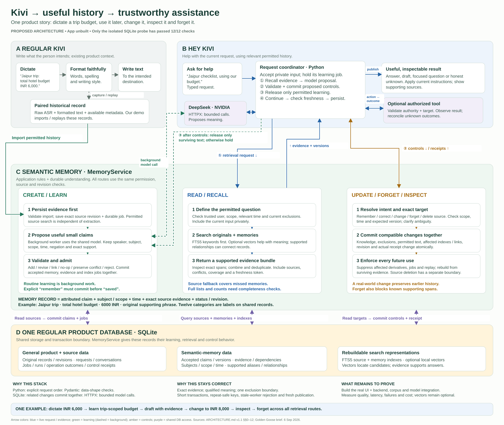

# Golden Goose · semantic memory for Hey Kivi

A portable design and research repository for building inspectable memory over Kivi history. Regular Kivi preserves intended dictation; Hey Kivi uses relevant permitted history to answer, draft, clarify or perform an authorized implemented action. `MemoryService` interprets and retrieves supported knowledge over the **same SQLite database** as ordinary product records.

**Status:** architecture and visual explanations exist. The isolated SQLite contract experiment passes 12/12 checks. The product, CLI, migrations, importer, approximately 500-record corpus, live model integration, UI and product evaluation are **not built**. The probe does not establish semantic accuracy, real concurrency, disk recovery or performance.

## Start here

| Reference | Purpose |
|---|---|
| [ARCHITECTURE.md](ARCHITECTURE.md) | Governing technical contracts: modes, categories, schema, evidence, CRUD, request order, retrieval, tools and recovery |
| [BUILD_PLAN.md](BUILD_PLAN.md) | Required outcomes, implementation order, open decisions, evaluation protocol and submission checklist |
| [RESEARCH.md](RESEARCH.md) | Evidence, alternatives, technology rationale, failure cases and experiments; dated observations, not product measurements |
| [AGENTS.md](AGENTS.md) | Short continuation instructions for a new coding agent or chat |

These references plus this README replace **46 previous Markdown files**. Detailed contracts remain explicit; duplicated explanations and competing old plans leave the current checkout. The original notes are preserved in commit [`3586cf9`](https://github.com/harshith0518/semantic-memory---Sarvam---Task/commit/3586cf9). [Consolidation provenance](reference/documentation-consolidation.json) maps old files to their current homes. Current decisions come from the five files above.

The [assignment PDF](reference/Kivi_Golden_Goose_Task_Final.pdf) is authoritative; its [text extract](reference/Kivi_Golden_Goose_Task_Final.txt) helps search. The applicant must independently form/write Part One before Part Two. These AI-assisted technical documents do not replace it.

## Visual explanations



| View | Open / edit |
|---|---|
| Complete directed flow | [SVG](KIVI_COMPLETE_FLOW.svg) · [PNG](KIVI_COMPLETE_FLOW.png) |
| One topic at a time | [Navigable architecture guide](ARCHITECTURE_GUIDE.html) |
| Overall architecture + 15 detailed features | [SVG gallery](mentor-svg/index.html) · [images](mentor-svg/images/) · [download pack](mentor-svg/Golden-Goose-Mentor-SVG-Pack.zip) |
| Compact editable overview | [Excalidraw](mentor-excalidraw/Golden-Goose-Compact-Overview.excalidraw) |
| Six editable mentor frames | [Excalidraw](mentor-excalidraw/Golden-Goose-Mentor-Board.excalidraw) · [identical JSON scene](mentor-excalidraw/Golden-Goose-Mentor-Board.json) · [offline preview](mentor-excalidraw/index.html) · [download pack](mentor-excalidraw/Golden-Goose-Excalidraw-Pack.zip) |
| Dense advanced reference | [HTML map](ARCHITECTURE_MAP.html) · [SVG map](ARCHITECTURE_MAP.svg) |

Excalidraw scenes contain native editable shapes, text, arrows and frames. Import a downloaded `.excalidraw` file with Excalidraw's **Open** control. Structural and visual checks passed; native editor import was not verified end to end. Save mentor edits under a new name before regeneration.

SVGs are standalone vector text with no external assets. GitHub displays HTML source: clone/download to open the viewers in a browser. Either ZIP contains the full documentation handoff; nested ZIP downloads and Git history are omitted. Diagrams are design snapshots; the canonical contract governs compressed wording. The [original Mermaid source](reference/architecture-map.mmd) is retained for the dense map.

## Use on another machine

```sh
git clone https://github.com/harshith0518/semantic-memory---Sarvam---Task.git
cd semantic-memory---Sarvam---Task
```

Reading the documents and exports needs no install or API key. Open `ARCHITECTURE_GUIDE.html`, `mentor-svg/index.html` or `mentor-excalidraw/index.html` locally. Alternatively, with Python installed:

```sh
python -m http.server 8766 --bind 127.0.0.1
```

Open `http://127.0.0.1:8766/ARCHITECTURE_GUIDE.html`; stop with Ctrl+C. This serves documentation only. Commands assume Python 3.12 or later; use `python3` or Windows `py` if that is your installation's command.

Run the existing experiment and repository checks without third-party Python packages:

```sh
python research/validation/atomic_memory_probe.py
python tools/verify_repository.py
```

The experiment needs SQLite with FTS5, uses fresh in-memory databases and writes `research/validation/atomic_memory_results.json`. Its interleavings are sequential; it is not an application or LLM benchmark.

## Continue in a new chat

Give the new agent this checkout and use:

> Read AGENTS.md and README.md, then the relevant ARCHITECTURE.md and BUILD_PLAN.md sections. This is Golden Goose semantic memory for Hey Kivi. Preserve the contracts and explicit decisions. Only the isolated SQLite probe is implemented. Start from the first unfinished build milestone and make the smallest complete user journey work. Use RESEARCH.md for rationale instead of restarting research. Report actual validation and keep planned work distinct from implemented work.

Next: refine one recurring journey and its ambiguous, changed, forgotten and failed states, then build durable source import/search and one supported request with controls. The final submission needs a normal-user UI/backend. NVIDIA-hosted DeepSeek is the chosen model family; exact endpoint, UI framework and embedding default remain open.

## Maintain documentation

Committed exports are ready to read; regeneration is optional. Install the Python documentation dependencies in a virtual environment:

```sh
python -m venv .venv
# Windows PowerShell: .venv/Scripts/Activate.ps1
# macOS/Linux: source .venv/bin/activate
python -m pip install -r requirements-docs.txt
python guide/build_guide.py
python build_mentor_flow.py
python mentor-svg/build_svgs.py
python mentor-excalidraw/build_board.py
```

Font discovery supports Windows/macOS/Linux and searches for Arial or Liberation Sans. Install Liberation Sans on Linux if needed. For explicit font selection, set `KIVI_FONT_REGULAR` and `KIVI_FONT_BOLD` to font files. Different metrics can change wrapping; inspect affected exports. Paths resolve from the scripts rather than the developer's home directory.

PNG rendering uses Node.js and Sharp:

```sh
npm ci
node render_mentor_flow.cjs
node mentor-svg/render_svgs.cjs
node mentor-excalidraw/render_previews.cjs
```

Refresh portable packs and check exports:

```sh
python mentor-excalidraw/verify_board.py
python mentor-svg/build_svgs.py --pack-only
python mentor-svg/verify_pack.py
python tools/verify_repository.py
```

These are documentation utilities, not Kivi implementation. Product dependencies must be installed/pinned when development begins. Keep credentials, private histories, databases, model caches and local environments outside Git. Examples are fictional.
