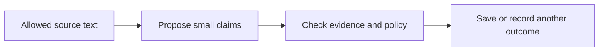

# Memory extraction and admission

[← Guide overview](README.md) | [Next work](10-next.md)

**Status:** Planned · product implementation pending. Snapshot: 6 September 2026.

**What should Kivi learn from a transcript?**

Turn permitted source text into useful, supported memories. Keep the original history searchable even when no memory is extracted.

## Step by step

1. **Read eligible text** A background worker reads a permitted record, with nearby context only when it helps resolve meaning.

2. **Propose separate claims** The model identifies the speaker, subject, meaning, scope and time. A plan, quotation or belief stays qualified.

3. **Check the proposal** Validate its source spans and structured fields, compare related memories, and apply the learning policy. Valid formatting alone does not prove a claim is supported.

4. **Record the outcome** Accept a new memory, make a supported update, link evidence, record a duplicate, preserve a conflict, or reject it. Rejection does not hide the permitted original source.

## Example

“For this trip, I prefer quiet hotels” can become a trip-specific preference. It does not establish a permanent preference for every future trip.

## Remaining work and decisions

- Implement the worker, extraction contract and admission decisions.
- Define concrete remember/ignore/uncertain examples, including sensitive information.
- Measure wrong-person claims, missed useful memories and unsupported inferences.

Technical details — open when needed

- Live input starts private with a held learning job. It is released only after current controls resolve; historical imports follow a separate ingestion path.
- A successful extraction with no useful memories differs from a failed model call or invalid response.
- Jobs carry source, policy and model versions. An obsolete worker attempt must not commit.

## Related processes

- [02 · Memory representation and storage](02-storage.md)
- [03 · Entity relationships and temporal updates](03-entities-time.md)
- [07 · Correction, forgetting and user control](07-controls.md)
- [09 · Evaluation and observability](09-evaluation.md)

Canonical reference: [ARCHITECTURE.md](../ARCHITECTURE.md), Sections 7–9; implementation order in section 16.

[← Overview](README.md) · [Memory representation and storage →](02-storage.md)
