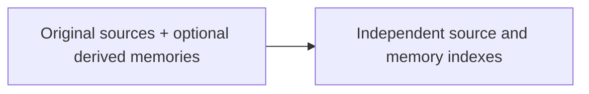

# Memory representation and storage

[← Guide overview](README.md) | [Next work](10-next.md)

**Status:** Planned · product implementation pending. Snapshot: 6 September 2026.

**What do we save, and where does it live?**

Keep source history, interpreted memories and rebuildable search indexes distinct inside one SQLite database.

## Step by step

1. **Preserve the observation** Store raw ASR, formatted text and supplied metadata under one record identity. The two text versions are one observation, not two witnesses.

2. **Represent the interpretation** A memory carries a subject, typed value, scope, time, evidence and lifecycle state. Revisions retain earlier interpretations and supported changes.

3. **Link back to evidence** Every accepted interpretation points to the exact source revision, field and supporting span.

4. **Build search aids** Keyword indexes and optional embeddings help find sources and memories. They can be rebuilt; they are not the only copy of knowledge.

## Example

One transcript can support three separate memories: Riya is the user's sister, the Jaipur hotel budget totals ₹6,000, and quiet hotels are preferred for that trip.

## Remaining work and decisions

- Implement real database migrations, constraints and indexes.
- Define import field validation, stable identities and revision behavior.
- Build inspection and reset commands against persistent data.

Technical details — open when needed

- The 12 categories are labels in shared tables: entities, relationships, preferences, constraints, routines, goals, plans/tasks/commitments, decisions, progress/blockers, beliefs/ideas, vocabulary and resources.
- Table groups: source revisions/heads; memory revisions/heads; evidence; entities/aliases/edges; exclusions; search documents/FTS/vectors; jobs/decisions; runs/attempts/operations/responses; owner revision counters.
- Source and memory indexes are independent: permitted source search remains available when extraction misses something.
- Persisted vectors and a loaded encoder provide reuse. Query, result and answer caches are initially off.

## Related processes

- [01 · Memory extraction and admission](01-learning.md)
- [03 · Entity relationships and temporal updates](03-entities-time.md)
- [04 · Retrieval and evidence selection](04-retrieval.md)
- [08 · Backend and application integration](08-application.md)

Canonical reference: [ARCHITECTURE.md](../ARCHITECTURE.md), Sections 1–4 and 10–11.

[← Memory extraction and admission](01-learning.md) · [Entity relationships and temporal updates →](03-entities-time.md)
