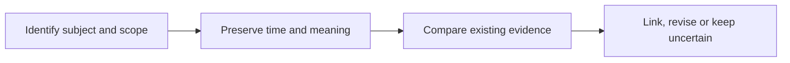

# Entity relationships and temporal updates

[← Guide overview](README.md) | [Next work](10-next.md)

**Status:** Planned · product implementation pending. Snapshot: 6 September 2026.

**Who does a memory concern, and when is it true?**

Connect related information without merging the wrong people or treating an old plan as current reality.

## Step by step

1. **Identify the participants** Record who spoke, who the claim concerns and which project, trip or task it belongs to. A matching name alone does not establish identity.

2. **Keep the claim's meaning** Separate events, intentions, commitments, hypotheses and reported beliefs. Preserve negation and uncertainty.

3. **Interpret time carefully** Event time, validity time, capture time and import availability have different roles. Missing dates remain unknown.

4. **Update only with support** Replace a value only when evidence establishes a matching subject, scope and meaningful change. Otherwise retain alternatives or conflict.

## Example

“Change the Jaipur budget from ₹6,000 to ₹8,000” supports a new current value while preserving the earlier budget. An old transcript imported later should not restore ₹6,000 as current.

## Remaining work and decisions

- Implement entity/alias decisions with evidence and reversible links.
- Define supported predicates, units, scope and replacement rules.
- Evaluate dates, pronouns, conflicting records and same-name people.

Technical details — open when needed

- Correcting an earlier mistake differs from recording a real-world change.
- Task completion is separate from whether a memory assertion is active or superseded.
- Relationship edges inherit supporting evidence, attribution, polarity, time and scope. Removing their support must invalidate dependent links.
- A graph server is not part of the starting design; supported relationships can live in ordinary SQLite tables.

## Related processes

- [01 · Memory extraction and admission](01-learning.md)
- [02 · Memory representation and storage](02-storage.md)
- [04 · Retrieval and evidence selection](04-retrieval.md)
- [07 · Correction, forgetting and user control](07-controls.md)

Canonical reference: [ARCHITECTURE.md](../ARCHITECTURE.md), Sections 3–4 and 9.

[← Memory representation and storage](02-storage.md) · [Retrieval and evidence selection →](04-retrieval.md)
