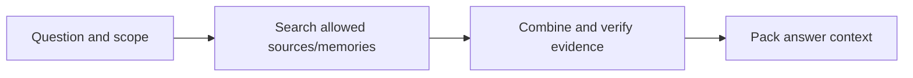

# Retrieval and evidence selection

[← Guide overview](README.md) | [Next work](10-next.md)

**Status:** Planned · product implementation pending. Snapshot: 6 September 2026.

**How does Kivi find the right history for a question?**

Search both original sources and learned memories, then deliver the evidence needed for a supported answer.

## Step by step

1. **Interpret the request** Identify the topic, relevant time and scope without inventing missing metadata.

2. **Search permitted material** Start with keyword search. Test optional meaning-based search on sources and memories. Every result must pass current scope, revision and exclusion checks.

3. **Find all necessary support** Deduplicate overlapping results, inspect original spans and retrieve bridge evidence when information is distributed across records.

4. **Pack a bounded evidence bundle** Keep decisive source text, memory interpretations, conflicts, source IDs and coverage/readiness information within the context budget.

## Example

“What changed about our Jaipur plan?” may need an earlier budget, a later update and a separate hotel preference. One similar-looking transcript may not be enough.

## Remaining work and decisions

- Implement keyword source search and evidence packing first.
- Compare source-only retrieval with typed memory and optional embeddings.
- Measure multilingual retrieval, missed evidence and complete-list questions.

Technical details — open when needed

- The shared read_evidence/eligible_text boundary governs source search, vector expansion, full-history baselines, inspection and other history reads.
- Top-k results cannot prove a count or complete list. Use scoped enumeration and source fallback; report truncation when limits prevent completeness.
- Proposed starting budgets: top 20 per retrieval list, reciprocal-rank fusion k=60, up to 40 fused candidates, and 4,096 evidence tokens. These are tunable, unmeasured defaults.
- Optional relationship expansion is bounded to one supported hop. Local E5-small is the first embedding candidate; its benefit and speed remain unmeasured.

## Related processes

- [02 · Memory representation and storage](02-storage.md)
- [03 · Entity relationships and temporal updates](03-entities-time.md)
- [05 · Context application and personalization](05-context.md)
- [06 · Uncertainty, clarification and abstention](06-uncertainty.md)

Canonical reference: [ARCHITECTURE.md](../ARCHITECTURE.md), Sections 5 and 9–10.

[← Entity relationships and temporal updates](03-entities-time.md) · [Context application and personalization →](05-context.md)
