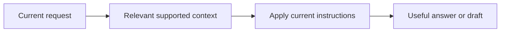

# Context application and personalization

[← Guide overview](README.md) | [Next work](10-next.md)

**Status:** Planned · product implementation pending. Snapshot: 6 September 2026.

**How does remembering something improve the result?**

Apply relevant known context to the current answer or draft, while respecting what the user asks for now.

## Step by step

1. **Start with the present task** Determine the result the user wants, such as a reminder of a promise, comparison of changes or a checklist.

2. **Use only helpful context** Apply a known budget, project detail or scoped preference when it materially helps. A retrieved memory need not be mentioned just because it exists.

3. **Respect instruction priority** Current explicit instructions override remembered preferences for this request. A one-off instruction does not automatically become a permanent rule.

4. **Make the result inspectable** Support personal-history claims with sources. Keep proposed drafts and actual tool outcomes distinguishable.

## Example

A hotel checklist can respect the latest trip budget and quiet-hotel preference. Remembering those constraints does not establish hotel availability or a completed booking.

## Remaining work and decisions

- Select the first recurring task this behavior should help with.
- Implement the answer/context contract and source presentation.
- Evaluate useful adaptation and unwanted personal callbacks.

Technical details — open when needed

- Regular dictation should preserve the intended content. This semantic assistance primarily belongs in Hey Kivi.
- “Visited Paris” does not imply enjoyment, a preference for France or a desire to return.
- General knowledge, personal evidence and observed tool results must remain distinguishable.

## Related processes

- [04 · Retrieval and evidence selection](04-retrieval.md)
- [06 · Uncertainty, clarification and abstention](06-uncertainty.md)
- [07 · Correction, forgetting and user control](07-controls.md)
- [08 · Backend and application integration](08-application.md)

Canonical reference: [ARCHITECTURE.md](../ARCHITECTURE.md), Sections 0.1–0.4, 7 and 9.

[← Retrieval and evidence selection](04-retrieval.md) · [Uncertainty, clarification and abstention →](06-uncertainty.md)
