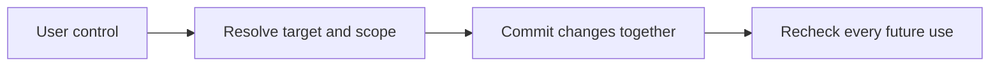

# Correction, forgetting and user control

[← Guide overview](README.md) | [Next work](10-next.md)

**Status:** Planned · product implementation pending. Snapshot: 6 September 2026.

**How can the user inspect and change what Kivi knows?**

Make inspection, correction and forgetting ordinary interactions, with actual committed changes behind every acknowledgement.

## Step by step

1. **Inspect or identify the target** Show the remembered interpretation and its sources, or resolve what the user's correction refers to.

2. **Apply the intended control** Remember stores supported knowledge; correct revises an interpretation; forget blocks selected information; delete-source also removes selected in-app source content.

3. **Commit before claiming success** Validate the target and expected revision, then update related state together. Unresolved or failed control handling must not produce a saved-success claim.

4. **Respect the change everywhere** Recheck original-source fallback, memories, indexes, worker results, aliases, derived artifacts and retained answers. Rebuild mixed-source material only from surviving evidence.

## Example

After “Forget the Jaipur budget,” repeating the budget inside that request must not teach it again. Future answers must not recover it from an old source index or retained reply.

## Remaining work and decisions

- Implement explicit control commands and normal-user controls.
- Build dependency invalidation and permitted-text filtering.
- Test controls during learning, answering, retries and replay.

Technical details — open when needed

- Forget means use blocking within the selected boundary; original history may be retained. Delete-source additionally removes the selected in-app original content. State the distinction clearly.
- Every model-facing history read uses the same current permitted-text boundary. A stale embedding cannot be used to recover excluded meaning.
- For live requests, unresolved controls keep the learning job held. Release only the surviving permitted projection.
- Already delivered text, user-owned exports, backups and provider retention are separate boundaries; do not promise universal physical erasure.

## Related processes

- [01 · Memory extraction and admission](01-learning.md)
- [02 · Memory representation and storage](02-storage.md)
- [04 · Retrieval and evidence selection](04-retrieval.md)
- [08 · Backend and application integration](08-application.md)

Canonical reference: [ARCHITECTURE.md](../ARCHITECTURE.md), Sections 4–8 and 12.3.

[← Uncertainty, clarification and abstention](06-uncertainty.md) · [Backend and application integration →](08-application.md)
