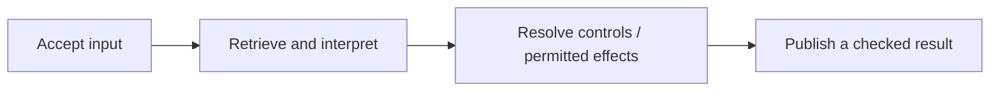

# Backend and application integration

[← Guide overview](README.md) | [Next work](10-next.md)

**Status:** Planned · product implementation pending. Snapshot: 6 September 2026.

**How do the interface, model, memory and tools work together?**

One coordinator and one MemoryService serve the intermediate CLI and the final interface. Historical import and live requests enter differently.

## Step by step

1. **1. Accept a live request** Persist its identity, run and private current source. Hold its learning job. The current run can use its own input immediately.

2. **2. Retrieve evidence** Read a coherent permitted snapshot, recent context and current input; capture a store-issued freshness token.

3. **3. Ask the model** Use the configurable NVIDIA/DeepSeek adapter to propose controls and one next step: answer, retrieve, act, clarify or abstain.

4. **4. Resolve controls** Validate and atomically commit compatible controls. If a control remains unresolved, keep learning held and block dependent effects; an independent partial draft may still be possible.

5. **5. Release surviving input** After controls resolve, publish only permitted current text into shared history and release the learning job. Ordinary extraction remains in the background.

6. **6. Continue if needed** Refresh changed evidence, make a bounded further read, or execute a registered tool within current authority. The application supplies the actual operation receipt.

7. **7. Accept the answer** Buffer output, then recheck knowledge, run, authority and cancellation state. Commit the accepted answer and final status together; refresh a stale result within the budget.

8. **8. Deliver or replay** Show the supported answer, sources and actual outcome. Replayed results must obey today's exclusions too.

## Example

A requested checklist can be drafted from history, corrected when the budget changes, and saved to an allowed local file only when that operation is actually requested and succeeds.

## Remaining work and decisions

- Implement importer, migrations, coordinator, worker and shared service.
- Verify the exact model endpoint, structured output, limits and usage accounting.
- Select the final interface/API adapter; connect the same core and add honest failure states.

Technical details — open when needed

- Historical import: validate raw_asr + formatted_text and optional metadata → persist source revisions → make permitted source search available → queue background learning. Historical instructions never grant current execution authority.
- Proposed import fields: schema_version, record_id/revision, paired text, captured_at/timezone/available_at, app/conversation_id/project_id and metadata. Missing metadata stays missing; import accounting includes accepted, duplicate, pending and rejected rows.
- Use short transactions, parameterized SQL and trusted user scope. Source changes and required jobs commit together. Model calls, embedding computation and external effects stay outside DB transactions.
- Same operation key and payload replays its receipt; a changed payload conflicts. Worker attempt tokens reject stale completion. Failed runs resume through linked attempts with retained operation receipts.
- The narrow freshness exception permits rebasing only for promotion of identical current text already seen by the run, without an intervening knowledge/control change. Publication still rechecks the resulting revision.
- First proposed tool: a requested local artifact. Validate path, version and authority, then record succeeded/failed/unknown. Reconcile an unknown effect before retry; cancellation after dispatch does not promise rollback.
- Proposed limits: four answer-model attempts, six follow-up reads, one external effect and a 30-second ordinary-request deadline. These are starting limits, not measured performance.
- Configuration: NVIDIA_API_KEY, KIVI_LLM_BASE_URL, KIVI_LLM_MODEL, KIVI_DB_PATH and KIVI_EMBEDDING_MODEL. Exact versions and behavior remain to be verified. Local storage still sends eligible model context to the hosted provider.

## Related processes

- [01 · Memory extraction and admission](01-learning.md)
- [04 · Retrieval and evidence selection](04-retrieval.md)
- [06 · Uncertainty, clarification and abstention](06-uncertainty.md)
- [07 · Correction, forgetting and user control](07-controls.md)
- [09 · Evaluation and observability](09-evaluation.md)

Canonical reference: [ARCHITECTURE.md](../ARCHITECTURE.md), Sections 1–2, 4–8 and 10–11.

[← Correction, forgetting and user control](07-controls.md) · [Evaluation and observability →](09-evaluation.md)
