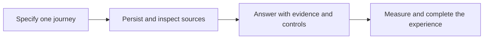

# What to do next

[← Guide overview](README.md) | [Next work](10-next.md)

**Status:** Next work · not started. Snapshot: 6 September 2026.

**What is the next concrete piece of work?**

Finish the behavior specification for one useful journey, then build the smallest persistent, evidence-backed version of it.

## Milestones and completion criteria

1. **Immediate milestone 1 · Define expected behavior** Select one recurring user task and describe its normal, ambiguous, changed, forgotten and failed states. Completion means the expected result is explicit in each state, with mode boundaries and retention wording. The Jaipur walkthrough is an existing illustration, not a finalized product choice.

2. **Immediate milestone 2 · Build durable source import** Implement migrations, import/reimport identities, permitted-text filtering, source inspection and keyword search. Completion means a small reviewed fixture survives restart, repeat import does not create unintended duplicates, and every allowed source can be inspected. Begin evaluation fixtures here.

3. **Immediate milestone 3 · Complete one real answer path** Connect the model adapter and coordinator to persisted sources. Add citations, honest unknowns and explicit correction/forget controls. Completion means a typed request returns a supported result, controls have actual receipts, forgotten text cannot return through source fallback or replay, and calls/latency are recorded.

4. **Then · Add memory through measured comparisons** Implement selective background extraction, scoped entities and temporal updates. Compare optional embeddings and relationship expansion against the simpler source route; retain only justified complexity.

5. **Then · Finish the ordinary user experience** Connect a normal-user interface to the same backend, including evidence, controls, ambiguity and failure states. Add the narrow tool needed by the selected task; the CLI remains an intermediate development surface.

6. **Finally · Prove and package** Complete the approximately 500-record corpus, development/sealed comparisons, real integrity tests and setup/import/evaluate/reset runbook. Rehearse the review from a clean checkout.

## Example

First success should be observable: ask a question against persisted history, inspect the exact source, change or forget the relevant information, and see the next answer respect that control.

## Remaining work and decisions

- The applicant's independently formed and written Part One position (≤100 words) and vision (≤600 words) are required before Part Two; they were not found in the inspected folder. This technical guide does not replace them.
- Keep graph servers, Redis, answer caches, autonomous reflection and broad integrations deferred until a measured need appears.
- The next recommended work is the small behavior specification; application implementation has not begun in this guide update.

Technical details — open when needed

- No numeric completion percentage is assigned: planning coverage and implemented product behavior are different kinds of progress.
- The source path must include relevant scope, exclusion, correction and trace rules from its first implementation; correctness is not postponed until after retrieval.
- Develop the corpus format and reviewed questions early, but keep sealed cases separate from tuning. No model key is needed to read or refine this guide.

## Related processes

- [08 · Backend and application integration](08-application.md)
- [02 · Memory representation and storage](02-storage.md)
- [04 · Retrieval and evidence selection](04-retrieval.md)
- [07 · Correction, forgetting and user control](07-controls.md)
- [09 · Evaluation and observability](09-evaluation.md)

Canonical reference: [ARCHITECTURE.md](../ARCHITECTURE.md), Sections 0.3, 15 and 16.

[← Evaluation and observability](09-evaluation.md) · [Overview →](README.md)
