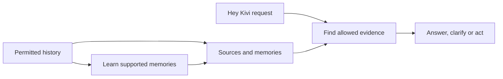

# Golden Goose: start with the overview

[Open the navigable guide](../ARCHITECTURE_GUIDE.html) · [What to do next](10-next.md) · [Canonical technical plan](../ARCHITECTURE.md)

Snapshot: 6 September 2026. The design and research are documented. An isolated storage experiment passed 12/12 checks. **The application remains unbuilt.**

## The concise picture

The history-to-memory route runs in the background. Original sources remain searchable even when extraction finds nothing. The request route can use current input immediately. User controls apply across both routes; the application coordinates them and evaluation checks the result.

## Open only the process you need

| Topic | Question it answers |
|---|---|
| [01 · Memory extraction and admission](01-learning.md) | What should Kivi learn from a transcript? |
| [02 · Memory representation and storage](02-storage.md) | What do we save, and where does it live? |
| [03 · Entity relationships and temporal updates](03-entities-time.md) | Who does a memory concern, and when is it true? |
| [04 · Retrieval and evidence selection](04-retrieval.md) | How does Kivi find the right history for a question? |
| [05 · Context application and personalization](05-context.md) | How does remembering something improve the result? |
| [06 · Uncertainty, clarification and abstention](06-uncertainty.md) | What happens when memory is missing or ambiguous? |
| [07 · Correction, forgetting and user control](07-controls.md) | How can the user inspect and change what Kivi knows? |
| [08 · Backend and application integration](08-application.md) | How do the interface, model, memory and tools work together? |
| [09 · Evaluation and observability](09-evaluation.md) | How will we know that the system works? |
| [Next · What to do next](10-next.md) | What is the next concrete piece of work? |

Each topic has a small diagram, numbered steps, an example, remaining work, optional technical detail and links to neighboring processes. The HTML guide shows one topic at a time and its URL fragment identifies the selected topic.

## Next work

1. Specify one useful journey and its normal, ambiguous, changed, forgotten and failed states; account for the applicant's independently authored Part One.
2. Build durable source import, inspection and keyword retrieval with the relevant scope/exclusion rules.
3. Complete one supported answer path with citations, explicit controls and actual usage records.

See [the milestones and completion criteria](10-next.md) before adding optional complexity. Build the evaluation fixtures alongside the first implementation.

This is an explanatory guide, not a new architecture decision or a claim of implementation. `ARCHITECTURE.md` remains the canonical technical reference. The older [full map](../ARCHITECTURE_MAP.html) remains an advanced reference.

## Maintaining this guide

Edit `guide-data.json` and `guide-template.html`, then run `python guide/build_guide.py` from `golden-goose`. This uses Python's standard library and regenerates the HTML guide and separate Markdown chapters. It is documentation tooling, not the Kivi application.
