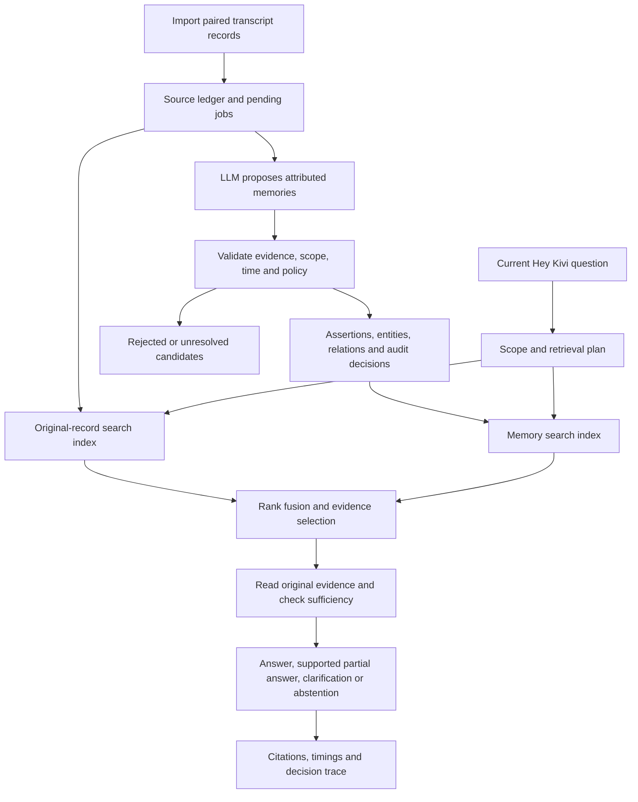

# Semantic-memory architecture proposal

Status: research-backed starting design, not an implemented or benchmarked system. Planning only, per the user's latest instruction; credentials and product development follow later. Research date: 5 September 2026.

Update, 6 September 2026: [the finalized v1 blueprint](../ARCHITECTURE.md) is the canonical contract. The [earlier end-to-end design](END_TO_END_DESIGN.md) provides supporting explanation. Where runtime ordering, schema details or illustrative counts differ, the finalized blueprint takes precedence.

Read PRODUCT_QUESTIONS.md first. This document develops the technical options; it is not the applicant's Part One submission.

## Decision

Start with Python, SQLite, indexed source records, typed memory assertions, a small entity/relation model, and hybrid lexical plus multilingual vector retrieval. Use an NVIDIA-hosted DeepSeek model behind a configurable adapter for extraction and answers. Begin with a CLI that calls a reusable memory service; a later UI calls that same service.

This is the best-justified starting point for the stated constraints, not a claim of universal superiority. A graph database, hierarchical summarizer, reranker, or memory framework must demonstrate value on the same evaluation before becoming a dependency.

Independent reviews changed the build order: establish source-only and full-history baselines before comprehensive extraction. A memory ledger with correction and provenance remains central, but the amount of derived structure must be justified by useful behavior. Five hundred records alone do not prove that the usable context window is too small.

Why: the brief requires approximately 500 source records, provenance, lifecycle management, history-grounded questions, reproducibility, and inspectable decisions. The central difficulty is preserving meaning and evidence as information changes. Database complexity alone does not solve that problem. SQLite FTS5 and exact vector search are sufficient candidates at this scale, subject to measured corpus expansion and hardware performance. [SQLite FTS5](https://sqlite.org/fts5.html), [exact semantic search](https://www.sbert.net/examples/sentence_transformer/applications/semantic-search/README.html)

## Architecture



The answer path sees original evidence as well as derived assertions. Extraction is lossy; a rejected or missed memory must not make a permitted source record permanently undiscoverable. Explicitly excluded/forgotten sources remain excluded from this fallback.

## Three different kinds of stored material

1. **Source evidence:** original raw ASR, formatted text, and supplied metadata. Preserve them under the same source record ID. Do not overwrite one with the other or count them as independent corroboration. Records are append-only for ordinary processing, with explicit deletion as an exception.
2. **Derived understanding:** attributed assertions, preferences, episodes, plans, entities, and relations with evidence references and lifecycle status. These can be corrected, superseded, rejected, or removed.
3. **Acceleration artifacts:** normalized text, FTS indexes, embeddings, optional summaries, and later caches. They are rebuildable and must never become the only copy of evidence.

This source-versus-derived separation follows established data-system practice. It does not imply a need for Kafka or distributed event infrastructure here. [Kleppmann's author-published explanation of derived data](https://martin.kleppmann.com/2015/05/27/logs-for-data-infrastructure.html)

## Stable schema, flexible content

| Logical table | Purpose |
|---|---|
| `source_records` | User ownership, source ID/revision, raw ASR, formatted text, optional captured time/app/session/project fields, original metadata, input hash, import time |
| `memory_candidates` | Proposed assertion, evidence spans, extraction version, accepted/rejected/unresolved decision and concise reason |
| `memories` | Stable memory ID, kind, subject, predicate/value, modality, event-time bounds, current status and revision links |
| `memory_evidence` | Many-to-many links to source revisions, source field and exact character spans |
| `entities` / `aliases` | People, places, organizations, projects, and observed names; ambiguous names remain separate |
| `relations` | Subject-predicate-object links with their supporting memory IDs; graph traversal can initially use SQL joins |
| `embeddings` | Source/memory ID and revision, input hash, embedding model/version/dimension and vector |
| `jobs` / `runs` | Processing stages, retries, errors, configuration versions, token counts and timings |
| `exclusions` | User-scoped source/span/category suppression and memory generation for forgetting |

Require user scope even in the single-user CLI. Project scope is optional context, not proof of authorization, identity, or a current Kivi project feature. When a UI is added, authenticated application code must enforce scope independently of the LLM.

A small fixed `kind` set can distinguish facts, preferences, episodes, plans, and relationships. Text and extensible metadata handle varied domains. Time, attribution, modality, and evidence are separate fields, not inferred from category alone. Do not require all metadata to exist: the evaluation corpus supplies ordinary logs, not our ideal ontology.

LLM-generated tags such as `travel`, `work`, or `France` can overlap. Normalize aliases and retain the original generated label for debugging. They are hints and browsing facets, not the only route to a memory. A `travel > countries > France > Paris` hierarchy must not exclude a work trip or a French language-learning question. Unknown tags must not force new tables or prompt rewrites.

## Ingestion and admission

1. Validate the import format, preserve supplied data, and assign stable source IDs. Uniqueness is scoped by user, upstream record ID and revision. A content hash detects unchanged input; it must not merge separate real events containing identical text. Idempotent reimport must not multiply records or corroboration.
2. Persist sources and pending jobs transactionally. Ingest chronological context when available, but do not equate chronological adjacency across apps with the same conversation.
3. Provide the extractor with the record pair, known source context, policy version, and a bounded amount of justified neighboring context.
4. Ask for structured candidates containing subject, assertion, modality, evidence spans, temporal expressions, entities, tags, and possible existing-memory relationships. An empty candidate list is valid.
5. Validate schema, source existence, span text, ownership, lifecycle transitions, and policy restrictions in code. Valid JSON and a valid quotation still do not prove that the assertion follows from that quotation; audit semantic errors separately.
6. Compare potential duplicates or contradictions using scoped candidate retrieval. In one transaction, apply supported changes, evidence/relations, lexical-index maintenance, decision records, and pending embedding jobs. Keep uncertainty when the evidence does not establish a resolution.
7. Compute embeddings outside the transaction, then atomically commit results and job completion against the expected revision. Identify jobs by source revision, stage and configuration version. An already committed retry returns its recorded result; a model timeout can still cause repeated external charges, so do not promise exactly-once model execution.
8. Before committing a delayed result, compare source/memory revisions and exclusion generation within the transaction. Discard or requeue stale work. Start with one worker, short transactions, and a bounded retry policy. Lexical reads can work while embeddings are pending; expose incomplete dense coverage and exclude obsolete vectors. Do not hold database transactions during model calls.

The Markdown policy should guide extraction and selection. The LLM must not edit its policy, schema, permissions, or executable SQL. Policy text is not a security boundary. Pin prompt and policy hashes so an evaluation can identify which rules produced each memory. [Mem0 extraction/update paper](https://arxiv.org/html/2504.19413v1), [A-MEM's adaptive metadata approach](https://arxiv.org/html/2502.12110v1)

When raw ASR and formatted text disagree about a material name, negation, date, subject or completed action, use an explicitly supplied user correction if one exists. Otherwise retain the disagreement and avoid promoting the disputed interpretation to an established personal fact. Formatting fluency and extraction confidence are not authority. Supported portions may still be admitted and both source variants remain available for qualified recall.

Examples the pipeline must distinguish:

| Source says | Eligible understanding | Unsupported conversion |
|---|---|---|
| I visited Paris in June | A visit, with June but no invented year | User loved Paris |
| I want to visit Paris | An intention or interest | Completed visit |
| My sister visited Paris | Reported event about the sister | User visited Paris |
| Write a message saying I resign | A drafting request | Confirmed resignation |
| If we launch Friday, notify Arun | A conditional plan | Confirmed launch date |
| I used to prefer morning calls; now afternoons work better | Preference change with evidence | Both preferences simultaneously current |

Assistant output must not recursively become independent evidence of the user's life. A later explicit user confirmation is a new source with appropriate attribution.

## Time and corrections

Store when an event occurred separately from when it was recorded and imported. Preserve vague or missing times and the original time phrase. Resolve “yesterday” only when the record date/timezone supports it. Hindi/Hinglish expressions such as `kal` require contextual interpretation and can remain uncertain.

“I moved from Pune to Delhi in July” is a change of state. “I said Delhi but meant Pune” corrects an error. Both need provenance, but they must not produce the same history. Arrival order does not establish current truth: a late import can describe an old event. Overlapping incompatible assertions remain conflicted unless evidence resolves them. Evidence-backed compatible facts may coexist.

Graphiti supplies useful temporal and provenance semantics, while a graph engine is an implementation option. Inspect its current code and pin a version if adopted; its paper, open-source repository, and hosted Zep are not interchangeable performance claims. [Zep paper](https://arxiv.org/html/2501.13956v1), [Graphiti](https://github.com/getzep/graphiti)

## Retrieval and personalization

Use two searchable views: original source records and derived memories. On each question:

1. Apply trusted user scope and explicit supported constraints. Retain uncertainty about missing dates or project metadata.
2. Run lexical search for names, exact terms, numbers, and phrases, and multilingual vector search for paraphrases and cross-language matches. Search both views.
3. Fuse rankings with reciprocal rank fusion, deduplicate evidence, and choose a bounded context. Do not interpret retrieval similarity or fused rank as probability of truth.
4. Expand through supported entity relationships or a bounded follow-up query when the question requires a second connection. Inspect whole records around relevant spans.
5. For counts, complete histories, or “what changed,” use structured filtering and source-set coverage; an arbitrary top-k cannot guarantee completeness.
6. Use relevant original evidence to compose the answer. Distinguish confirmed facts, reasoned conclusions, and unresolved alternatives. Verify cited IDs/spans exist and inspect claim support in evaluation.
7. Include personalization only when it helps the request. Supported memories can influence the answer without being explicitly mentioned. Before releasing an answer after a model call, revalidate its evidence against a fresh source/exclusion generation; retry or redact stale material if corrections or deletion happened during generation.

At this scale, exact cosine similarity over precomputed vectors is a suitable starting candidate. Store model and normalization metadata; incompatible embeddings cannot be mixed. Evaluate a compact multilingual embedding model first against a larger comparator. Hindi/Hinglish performance cannot be inferred from a generic multilingual label. FTS5's Unicode handling also needs combining-mark tests; it supplies neither semantic search nor transliteration equivalence.

The proposed CPU baseline is `intfloat/multilingual-e5-small`; compare `BAAI/bge-m3` if retrieval failures justify its larger footprint. Use each model's own tokenizer and input conventions. E5 requires `query: ` and `passage: ` prefixes and token-aware chunks within its input limit. Measure cold model loading as well as warm search. A local embedding model needs no second API key, but does require a model download and compute resources. An NVIDIA-hosted multilingual embedding endpoint is an optional alternative whose access and quality must be verified separately. [E5 model card](https://huggingface.co/intfloat/multilingual-e5-small), [BGE-M3 model card](https://huggingface.co/BAAI/bge-m3)

Add a cross-encoder reranker only after measuring its benefit and latency. Start with zero persistent answer cache. A bounded recent-context window is not a cache. Recent information gets no authority advantage over old, more relevant evidence. If caching is later useful, key it by user/scope, corpus generation, retrieval/model/policy versions, and invalidate on correction or forgetting. [Hybrid contextual retrieval](https://www.anthropic.com/engineering/contextual-retrieval), [MemGPT](https://arxiv.org/abs/2310.08560), [RAPTOR](https://arxiv.org/abs/2401.18059)

## France example: where each piece comes from

Input history: record 14 explicitly says “I visited Paris in June.” Current request: “I want to know more about France.”

- The personal-memory evidence establishes the user's Paris visit only.
- Query expansion may connect France and Paris through general geographical knowledge. That knowledge is not a second personal-memory source.
- Search can find the visit via entity links, text/vector similarity, or optional tags. No specific folder placement is required.
- The answer may use Paris as a familiar reference point if helpful, with record 14 inspectable as support. It must not add enjoyment, dates, companions, or interests absent from the evidence.
- If the visit is uncertain or irrelevant to the question, omit the personal callback and answer the general question.
- If the user later asks for live travel information, an external information source may be needed. It stays separate from personal-history evidence and cannot overwrite it.

Evaluate usefulness and unwanted callbacks separately. Benchmarks support relevant profile retrieval, but do not establish a universally comfortable frequency of spontaneous personal references. [LaMP](https://github.com/lamp-benchmark/lamp), [PrefEval](https://arxiv.org/abs/2502.09597)

## User correction and forgetting

Normal revision retains history. Explicit forgetting has separate semantics:

- Suppress a memory from use and future extraction from its supporting sources; clearly disclose whether the raw source remains.
- Delete a source when requested, including dependent index entries, copied quotes, and summaries. Recompute mixed-source artifacts from surviving permitted evidence.
- Record minimal content-free audit metadata and exclusions. Old jobs and stale caches must check the current memory generation before returning or writing results.
- Remove copied forgotten content from rejected candidates, generated prompts/responses, traces, and derived aliases as well as the main memory table. The original import file, external originals, backups, and provider-held requests are separate retention boundaries; document them instead of claiming database deletion erases every copy.
- Opaque source exclusions cannot recognize every future paraphrase of a forgotten fact. A broader topic/attribute exclusion is a different user control; do not promise perfect semantic erasure from arbitrary new inputs.

The user should not manage graph nodes, merge duplicate rows, or approve every candidate. Preserve uncertainties in the background and clarify at the point where they matter. Optional clarification means a safe fallback if skipped, not permission to guess or execute an uncertain action.

Regular dictation may supply evidence for later use while its output preserves the current intended message. Hey Kivi is the explicit request mode that can retrieve history and prepare an answer or draft. A personalized draft intended for someone else needs its own disclosure check: a fact being known to Kivi does not establish that it should be included in an outgoing message. Current explicit instructions override historical style preferences.

## Proposed CLI boundary

The following are planned commands, not available software:

```text
kivi init
kivi import history.jsonl --user demo
kivi process --user demo --resume
kivi ask --user demo "What changed about the launch?"
kivi search --user demo "Paris"
kivi inspect memory <id>
kivi inspect source <id>
kivi correct memory <id> --text "..."
kivi forget memory <id>
kivi delete-source <id>
kivi evaluate --suite evaluations/questions.jsonl
kivi reset --user demo
```

CLI commands should call ordinary service functions rather than coupling memory logic to terminal I/O. The later interface uses the same functions through HTTP. `ask` should return answer status, text, source citations, concise decision codes, processing version, and timings. Do not depend on hidden chain-of-thought; decision traces are observable actions and evidence.

User preference: NVIDIA-hosted DeepSeek; leave the key absent until development. Proposed configuration includes `NVIDIA_API_KEY`, `KIVI_LLM_BASE_URL`, `KIVI_LLM_MODEL`, and separate embedding model settings. Verify structured-output and reasoning-mode behavior for the actual selected NVIDIA endpoint rather than assuming every compatible endpoint supports identical features. Use bounded retries, backoff, resumable jobs, token limits, and explicit failure records. Do not install or call paid services during planning.

## Evaluation before adding features

Create or obtain approximately 500 transcript-like records. Separately author questions, labels, supporting spans and answerability rubrics. Test English, Hindi, Hinglish, quoted speech, plans, negation, changed preferences, old relevant facts, same-name people, missing metadata, deleted sources, and malicious instructions inside transcripts.

Compare lexical source retrieval, multilingual dense retrieval, their hybrid, and the hybrid with typed memory. Include full-history input when it fits and gold-evidence input as diagnostic baselines. Add graph expansion, tags, summaries, and reranking one at a time to measure their contribution. Keep the answer model and evidence budget comparable.

Also compare each candidate's achievable quality/cost setting: restricting full-history input to a retrieval-sized budget would unfairly weaken that alternative. Record preprocessing cost and realistic expected query count so ingestion costs are not hidden. Use public benchmark results as motivation for local comparisons, not proof of superiority. [Long-context versus retrieval study](https://aclanthology.org/2024.emnlp-industry.66/)

Create a corpus manifest with actual lengths/token counts, languages/scripts, missing metadata, duplicates and disagreements. The revised proposed initial suite is 80 hand-reviewed probes, split into 30 development and 50 frozen evaluation probes by whole scenario/template blocks; this is a project default, not an assignment requirement or adequate statistical evidence for every language slice. See [the evaluation protocol](design-review-evaluation.md). Keep gold answers outside ingestion. Temporal replay admits only evidence available at the query cutoff. Freeze prompts and thresholds before opening evaluation labels. Larger synthetic stress suites are reported separately.

Report admission precision/recall, unsupported personal facts, evidence recall and full-evidence coverage, answer correctness, citation support/completeness, stale answers, false abstentions, and inappropriate personal callbacks. Inspect both answered coverage and error rate: always abstaining is not success.

Measure ingestion and retrieval separately from model time, query encoding, and answer generation. Include cold/warm p50/p95 with sample counts, retries/failures, database/index size, model calls, token usage, and recorded pricing basis. Unknown cost is unknown, not zero. A free endpoint can still have quotas and variable latency. Vendor memory benchmarks do not establish results for this dataset. [LongMemEval](https://github.com/xiaowu0162/LongMemEval), [LoCoMo](https://aclanthology.org/2024.acl-long.747/)

## Development order after planning

1. Source schema, imports, reset, inspection, corpus manifest, and a small hand-reviewed adversarial fixture set.
2. First complete path: lexical source retrieval, cited answers and abstention; compare full-history input where feasible. Measure latency and tokens from this point.
3. Multilingual embeddings and hybrid source retrieval; retain this executable baseline.
4. Resumable extraction, selective typed memories, admission decisions, evidence linkage, revisions and correction/deletion. Demonstrate the useful behavior these add against the baseline.
5. Frozen evaluation, failure/recovery tests, supported personalization, and the normal-user interface. Add only tools required for the chosen product experience.

Before expanding, require critical integrity checks to pass: repeated import does not duplicate a source; source IDs and citations are valid; correction during extraction rejects stale writes; deletion during answering does not release deleted content; restart resumes incomplete work; and scope cannot be widened by transcript/model text. These checks do not establish factual accuracy. Assess answer quality, answered coverage, useful preference application and time/cost separately; do not call a more complex variant an improvement without evidence. Set an actual latency/error budget on the target hardware and endpoint before comparing candidates.

Overturn conditions: if typed extraction fails to improve useful recall or personalization, simplify its scope; if full-history answers meet the same quality and operational needs more cheaply, use them for suitable query classes; if measured traversal depth or concurrent writing outgrows SQLite, evaluate Graphiti or Postgres on identical evidence; if unpredictable investigation consistently needs an adaptive loop, add bounded read tools. These are conditional choices, not requirements to implement every alternative.

The CLI is an intermediate development surface. The final Golden Goose submission still requires a usable web/desktop interface and backend together.

## What remains empirical

- Whether the selected DeepSeek endpoint reliably extracts attributed structured memories and handles Hindi/Hinglish.
- Which embedding model performs best within the user's actual latency/hardware limits.
- How much typed memories improve answers beyond source retrieval alone.
- Whether entity expansion or a graph engine fixes enough failures to justify added cost.
- How much spontaneous personalization users want in practice.
- The exact metadata in the hidden corpus, API quotas, and cold-start behavior.

No claimed speedups, accuracy percentages, or universal confidence thresholds are justified before those experiments.
