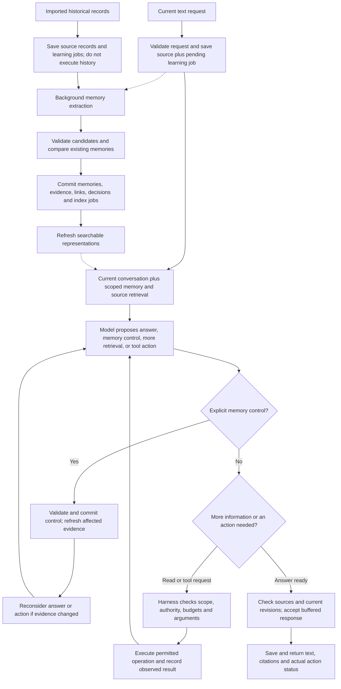

# Hey Kivi: end-to-end memory design

Proposed 6 September 2026. Planning only: no application, model calls, installations, latency measurements, or accuracy results. This develops the user's input -> storage -> memory -> model -> tools -> output idea. It is the current synthesis for runtime ordering and evaluation; the earlier architecture proposal supplies additional research detail. This is technical planning, not the applicant's Part One submission.

Superseded as the canonical contract by [the finalized v1 blueprint](../ARCHITECTURE.md). Read that document for explicit MemoryService boundaries, qualified assertion schema, source eligibility, live-source freshness, replay/resume semantics and the isolated validation results. This earlier document remains supporting explanation.

## Recommendation

Use one local SQLite database, a reusable Python service, an NVIDIA-hosted DeepSeek adapter, lexical source search, and a measured multilingual vector-search extension. Store durable memories and evidence in ordinary tables; represent relationships with supported entity/link tables. Start without a separate graph server, vector server, Redis, or persistent answer cache. The CLI is the first client; the eventual user interface calls the same service.

These are compatible layers, not competing definitions of memory:

| Concept | Job | Initial implementation |
|---|---|---|
| Conversation/source storage | Preserve what arrived, what Kivi returned, and observable tool results | Role- and origin-labelled records in SQLite |
| Semantic and episodic memory | Maintain useful, attributed interpretations and their history | Versioned memory rows with supporting source spans |
| Relationship graph | Connect people, tasks, places, decisions and events | Entity/link tables backed by memory evidence |
| Search | Find exact terms, paraphrases and connected evidence | FTS5; optional precomputed multilingual vectors scored locally |
| Working context | Hold the active request, relevant recent turns and selected evidence | Bounded request state in the service |
| Cache | Reuse an earlier computation while its dependencies remain valid | None for final answers initially |
| Harness | Coordinate model calls, controls, tools, errors and completion | Explicit application code with a bounded model/tool loop |

A relational database can represent a graph. SQLite's recursive queries support graph traversal; a graph visualization can also be built over these tables. Neither requires a dedicated graph engine. [SQLite graph-query documentation](https://sqlite.org/lang_with.html)

## Evaluation of the user's three steps

| Original idea | Keep | Refinement |
|---|---|---|
| Input enters Kivi | A clear application entry point | Distinguish a current request from a historical record being imported. Importing an old instruction must never execute it. |
| Store input; model checks create/update/remove/nothing/ambiguity | Durable input and explicit memory outcomes | Read related existing memories before deciding updates. Let the model propose changes and code commit validated operations. Ordinary enrichment can run in the background; explicit controls need synchronous completion semantics. |
| Combine memory and input; model returns output or performs work | Relevant context and useful tool support | Include permitted original evidence and current conversation context. The model proposes tool calls; the harness validates and executes them. Record confirmed results separately from intentions. |

The essential change is two coordinated paths: answering/acting now, and learning durable memory. They share one authoritative store but do not make every answer wait for all extraction and indexing.

## Overall flow

The diagram shows logical components, not separate microservices. Start with one process, one DB, and one background worker. Each loop has limits; a memory operation already applied in this request returns its recorded result rather than being applied again.

## Storage structure

These are logical table groups; exact migrations are development work.

| Group | Core fields and purpose |
|---|---|
| `records` | Stable ID and revision, trusted user scope, session/run, role, origin, input/output/tool-result kind, text, optional raw-ASR/formatted pair, supplied metadata, source time, ingest time |
| `memories` | Stable ID/revision, memory form, content category, subject, predicate/value, scope, modality, time bounds/original phrase, active/conflicted/superseded status, prior-revision links |
| `memory_evidence` | Memory revision -> source revision, field and exact supporting span; support/contradiction relation where appropriate |
| `entities`, `aliases`, `links` | Conservative identity resolution and relationships projected from supported assertions; links reference their supporting memory revisions |
| Search tables | FTS5 representations and vector rows, each tied to an allowed source/memory revision and encoder configuration |
| `jobs`, `memory_decisions` | Durable processing work, attempts, expected revisions, candidate/admission outcomes, concise reasons and versions |
| `runs`, `tool_calls`, artifacts | Observable steps, actual tool state, artifact paths/digests, timings, token usage, errors, result and publication sequence |
| User controls | Remember/correct/forget operations, exclusions, per-user content/control generations and minimal audit metadata |

Store the proposed 12 content categories as labels/subtypes on shared records. Do not create one database or inaccessible collection per category. Semantic, episodic and procedural form; topic; category; evidence; and time are separate dimensions. Preserve unclassified source content for search.

Keep source pairs together. Raw ASR and its formatted version are two representations of one observation, not two independent witnesses. Store assistant responses for conversation continuity; they are not automatically evidence that the user's life contains whatever the model wrote. A confirmed tool result can support a claim about that operation, with tool attribution.

Accepted memory is durable interpretation, not disposable cache. Re-running an LLM does not guarantee the same interpretation. Preserve admitted revisions and explicit corrections. Rebuildable FTS/vector representations are different: those can be regenerated from current permitted content.

## Live request sequence and model calls

1. **Receive and persist.** The service assigns a request ID and trusted scope. In a short transaction, save the input, maintain source lexical search, and enqueue ordinary learning work. If persistence fails, do not claim the input was remembered. Explicit CLI controls can directly name a memory ID.
2. **Build initial context.** Include the current input verbatim, a bounded relevant recent conversation, and scoped retrieval from both original records and derived memory. Read current exclusions and versions. New user information is available now even if no embedding or extracted memory exists yet.
3. **Ask the model.** The first answer-oriented call can return a provisional answer, a structured memory-control proposal, a request for more evidence, or a tool-action proposal. There is no mandatory additional LLM classifier before every question. The selected endpoint's structured-output/tool support must be tested during implementation.
4. **Apply explicit controls first.** Detected remember/correct/forget requests must resolve their target and scope and commit before a success acknowledgment or dependent action. Code checks ownership, evidence, allowed transitions and expected versions. If a target is ambiguous, ask only the missing question or give a limited response; do not guess a destructive target. Do not silently label pending background work as completed memory.
5. **Refresh if necessary.** A correction that changes applicable evidence invalidates stale context. Retrieve again and regenerate when needed. A provisional answer can be retained only if it remains supported after the control. Code can check citations, structured amounts and versions; it cannot generally prove every free-text inference. Material ambiguity warrants regeneration or clarification.
6. **Gather or act within bounds.** The harness may run a further search, inspect a source, or dispatch an authorized tool call. Add the observed result to request context and continue. Stop on completion, unresolved required input, an unknown external outcome, or exhausted configured limits.
7. **Accept and persist the response.** Check cited IDs/revisions, source eligibility, structural output and actual tool outcomes. Buffer the initial implementation's answer. Serialize final acceptance with control writes. In one short transaction, check fresh versions, assign the acceptance sequence, save the permitted assistant output and commit the terminal run outcome. A response accepted after a completed forget must not use excluded evidence. Do not save another content copy afterward that could recreate material a concurrent forget has purged.
8. **Return the committed result.** Return text, inspectable source citations, artifacts if created, and honest statuses such as completed, needs clarification, partial, failed or external outcome unknown. Deliver through the per-user ordered publication path. Acceptance is the ordering boundary; it is not a claim that a SQLite transaction makes network delivery atomic or retracts already transmitted content. A later forget invalidates retained/displayed copies within the documented application boundary.

For an ordinary recall question, the target path is one answer-model call plus retrieval, with background extraction accounted for separately. Controls, difficult evidence gathering and tool actions can require more calls. The configurable loop budget is a circuit breaker, not a quality guarantee; record all calls and do not claim constant latency.

Natural-language control detection remains model-dependent. A missed correction is not solved by checking JSON or source-span existence. Test linguistic variations and provide direct inspect/correct/forget controls as a dependable user path. Current explicit instructions take precedence over historical defaults within their actual scope.

Predictable workflows and a bounded adaptive loop serve different needs. The design starts with explicit orchestration and adds autonomous investigation only when simpler retrieval demonstrably fails. [Anthropic's workflow/agent distinction](https://www.anthropic.com/engineering/building-effective-agents)

## Background memory lifecycle

1. A worker claims a persisted source-revision job. Reimporting the same upstream ID/revision does not duplicate it. Separate records with identical text remain separate events unless actual identity evidence supports merging.
2. Read source context and a bounded set of potentially related existing memories. Do not treat adjacent imports from different apps as one conversation without evidence.
3. Ask for attributed candidates, source spans, scope, modality, time and suggested relationships. Empty output is valid. Categories are helpful labels, not mandatory destinations for every sentence.
4. Validate output structure and supporting references. Code rejects impossible spans, ownership changes and prohibited operations. Semantic entailment still needs evaluation: a valid quote does not prove the model's interpretation follows.
5. Distinguish add, duplicate/link-evidence, supported update, supersede, unresolved and no-op. A newly stated preference does not authorize arbitrary deletion of past records. An uncertainty can coexist with supported portions of the source.
6. Inside the admission transaction, compare the captured source/memory revisions and control/exclusion generations to their current values. Reject or requeue stale candidates before any write. Atomically commit accepted memory revisions, evidence, graph projections, lexical updates, decision records and vector jobs. Keep external model work outside the transaction.
7. Compute embeddings, then commit only if source/memory revisions and exclusions still permit the result. Delayed work must not recreate corrected or forgotten content.
8. Recover from crashes with unique job keys, leases/retry limits and persisted outcomes. Duplicate DB effects can be prevented; an ambiguous provider timeout may still incur repeated API charges.

This avoids an unsafe dual-write design where source storage succeeds while a separate memory system silently misses the update. A durable jobs table is sufficient here; a distributed log service is not required. [Kleppmann on logs and derived data](https://martin.kleppmann.com/2015/05/27/logs-for-data-infrastructure.html)

## Worked request: update a budget and create a file

This is a design walkthrough, not an executed test. Suppose source R14 says Riya is the user's sister, and R82 says the Jaipur trip's total hotel budget is INR 10,000. The current request is: "Update my Jaipur trip's total hotel budget to INR 6,000 and save a short hotel checklist for Riya as jaipur-checklist.md."

1. Save this request as R103 and retrieve the budget's scope plus the supported Riya identity. R103 itself is current evidence for the new amount.
2. The model proposes a budget update supported by R103 and a local file operation. The checklist can include comparing hotels against the total budget; unknown dates or a selected hotel remain unresolved rather than invented.
3. Code commits the new scoped constraint, links R103, and marks the old amount superseded for current-use questions. The prior budget remains available when explicitly asking about history. Any delayed job using the old revision cannot overwrite the update.
4. Refresh or validate the checklist against the committed amount. The harness resolves the file within its designated artifact area, checks existing-file/version behavior, and executes the authorized write. Missing target details are resolved only if needed; the chosen filename is already explicit.
5. Verify the file operation and record the actual path/result. If writing fails, the committed budget change still stands and Kivi must report partial success; a database transaction cannot make an external file write magically atomic with memory.
6. Atomically accept/save a final response with its run outcome: the budget was updated and the file was saved only if each operation actually succeeded. Return the file link and the budget's evidence. Background enrichment need not delay the result or count the assistant's sentence as another source.

This example demonstrates coordination rather than a fixed number of model calls: a simple valid proposal may need little further reasoning, while materially changed evidence or a tool failure can require another call.

## Retrieval and context construction

Start with source-only lexical retrieval as an executable baseline. Next evaluate multilingual dense retrieval alongside it. Short records can be indexed whole; long ones require token-aware chunks with source offsets and relevant surrounding context. Preserve negation, subjects and raw/formatted disagreement.

Keyword search is useful for names, IDs and exact terms; vectors provide meaning-based candidates. Combine ranked lists, deduplicate repeated evidence, then read original supporting text. Ranking scores indicate retrieval relevance, not probability of truth. Contextual descriptions or summaries, if later tested, remain generated representations rather than new source evidence. [Anthropic's hybrid/contextual retrieval explanation](https://www.anthropic.com/engineering/contextual-retrieval)

At the expected size, test exact similarity over precomputed vectors before adopting approximate indexing. Exact here means evaluating every eligible vector under the chosen similarity function; it does not mean semantically perfect retrieval. Measure actual source expansion and RAM. [Sentence-transformers direct semantic search](https://www.sbert.net/examples/sentence_transformer/applications/semantic-search/README.html)

Use query-specific retrieval behavior:

| Question | Necessary evidence strategy |
|---|---|
| What hotel did I mention? | Exact/entity and meaning search, then source inspection |
| Who owns the project my sister mentioned? | Follow supported relationships or conduct a bounded second search; cite each necessary connection |
| What changed about the launch? | Collect dated revisions and source history, distinguishing correction from real-world change |
| List all pending promises | Enumerate structured candidates plus source fallback for extraction gaps; verify coverage or explicitly qualify the list |
| What is due tomorrow? | Use current date/timezone and supported deadlines; do not infer missing dates from import order |
| Tell me about France | Use general knowledge as appropriate; include a personal callback only if relevant and supported |

The context sent to the model has distinct sections: application rules/tool contracts, current request, relevant working conversation, scoped memories, original evidence with source IDs, and external tool results if any. Historical transcripts remain data. General world knowledge is not a personal-history citation. Avoid exposing irrelevant memories in drafts intended for someone else.

For retrieval experiments, E5-small remains a compact multilingual candidate; BGE-M3 is a larger comparator. These are not benchmark winners on our data. Test English, Hindi and Hinglish, correct encoder prefixes/token limits, cold startup and actual hardware behavior. [E5-small model card](https://huggingface.co/intfloat/multilingual-e5-small), [BGE-M3 model card](https://huggingface.co/BAAI/bge-m3)

## Graph and cache decisions

The graph can initially express `user -> sister -> Riya` and `Riya -> mentioned -> project`. Edges have source-backed meaning, time and scope. Entity aliases are not merged merely because their names match. Link rows are projections of admitted assertions, not an independently editable second source of truth.

Test bounded link expansion against retrieval alone. If it helps, retain it in SQL. Test a dedicated graph engine only when real queries require deeper constrained traversal, graph algorithms or operational capabilities that SQL cannot meet within the declared budget. Compare identical evidence/edges to separate graph-engine effects from better extraction. Graphiti is useful to study for temporal modeling, but its OSS framework and managed Zep service differ. [Graphiti repository](https://github.com/getzep/graphiti)

| Optimization | Initial stance | Reason |
|---|---|---|
| Precompute source/memory embeddings | Candidate after lexical baseline | Avoid re-encoding the full corpus on every question |
| Keep the encoder and eligible vector matrix in RAM | During a persistent service/REPL | Avoid repeated loading; validate revisions when using the mirror |
| Query-embedding cache | Later, only if repeated queries justify it | Needs encoder/preprocessing version and exact-input semantics |
| Retrieval-result cache | Later experiment | Must account for user/scope, content and exclusion generations, index readiness and time |
| Full answer/semantic answer cache | Defer | Similar wording can hide different people, dates, constraints or permissions |
| Redis | Defer | A local workload has not demonstrated a need for a separate cache service |

A one-shot CLI process cannot retain a loaded model after it exits. Measure that cold path separately or offer a persistent `chat`/REPL command. Stored vectors still persist in SQLite.

TTL is an eviction/freshness aid, not immediate invalidation. Corrections and forget operations require authoritative checks even before a TTL expires. Relative-time queries can become stale without a database mutation. Provider prompt caching is a separate capability and must be verified for the actual endpoint; no NVIDIA cache support is assumed. [Chip Huyen on cache types and tradeoffs](https://huyenchip.com/2024/07/25/genai-platform.html#step-4-reduce-latency-with-cache)

## Tools and MCP

The model does not execute a file change by writing that it has done so. The harness owns a registry of permitted operations, validates arguments and dispatches a local adapter or MCP call. MCP standardizes tool discovery/calls/results; Kivi still implements its authorization and completion logic. Tool annotations from untrusted servers are not authoritative. [MCP tools specification](https://modelcontextprotocol.io/specification/2025-11-25/server/tools)

Start tool development, after memory works, with inspectable local artifacts: create/update a draft within the designated project area, return the artifact and an appropriate diff. Add external connectors only for a selected product capability. Existing explicit authorization should be reused within scope; ask only when required information or authority is missing. A historical promise to send something is not a current instruction to send it.

For each action retain operation ID, target, arguments, authority context, expected target version where supported, timestamps and observed result. States include proposed, running, succeeded, failed, and unknown outcome. A timeout after dispatch is unknown until a status/readback resolves it; do not retry an irreversible operation merely because no reply arrived. Idempotency depends on the tool/provider contract, not on the LLM repeating identical text.

A send operation, file edit or booking cannot participate in the SQLite transaction. Recheck relevant controls before dispatch; record observations afterward. Do not hold a database transaction across an external call or claim rollback of an irreversible external action. Tool tests use local fixtures or controlled stubs, not real messages or purchases.

## Consistency and user controls

| Situation | Required behavior |
|---|---|
| Embedding job is pending | Current text remains usable; lexical/source fallback works; dense coverage is explicitly incomplete |
| User changes a fact while extraction runs | Delayed extraction fails the expected-revision check; it cannot overwrite the newer control |
| User forgets while an answer is generating | Buffered output must pass the serialized acceptance/control check; regenerate if its evidence is no longer allowed |
| Database read uses an old snapshot | Reopen/freshly check at the acceptance boundary; do not assume the original snapshot sees changes |
| Raw ASR and formatted text disagree | Preserve the disagreement; do not prefer fluency over evidence |
| Old record is imported late | Interpret event/source time separately from arrival time |
| Tool times out after dispatch | Report unknown outcome and reconcile when possible |
| Model is unavailable | Retain accepted input/jobs; offer permitted source inspection or an honest failure, never fabricated recall |

SQLite gives transaction/snapshot mechanics, not these product guarantees automatically. Keep commits short, enable and verify constraints/index maintenance, and test actual `MATCH` results after updates/deletions. [SQLite isolation](https://sqlite.org/isolation.html), [FTS5 synchronization](https://sqlite.org/fts5.html#external_content_table_pitfalls)

Correction preserves the meaning of a change and its evidence. Forgetting suppresses use and future extraction from the relevant retained sources; deleting a source additionally removes its stored content and affected derivatives. Mixed-source memories must be recomputed or narrowed from surviving permitted evidence. Review copies in candidates, prompts, outputs, traces, aliases and internal generated artifacts; a main-table delete alone is insufficient. Retain minimal content-free control metadata, including for a forget request that itself repeats the target information. Clearly document source files, user-owned exported documents, backups, provider requests and already-delivered outputs as separate retention boundaries. A memory control must not silently edit unrelated user files. Do not promise recognition of every future paraphrase of a forgotten fact.

## Evaluation protocol before declaring this better

Use approximately 500 development history records, as in the brief, and a separate proposed set of **80 hand-reviewed questions/tasks: 30 development and 50 sealed evaluation**. This replaces the earlier illustrative 60-probe count. It is a feasible initial study, not enough to establish universal performance or reliable statistics for every small slice.

Freeze entire narrative/template blocks between development and evaluation. Query paraphrases about the same event stay together. The system receives the allowed history at each query cutoff; it never ingests gold answers or the sealed evaluation questions ahead of time. Clarification follow-ups are scripted and authorized as part of the task. Ordinary independent questions are not allowed to teach later test cases their answers. Multi-turn scenario tests reset and replay their own controlled sequence.

Compare at most four primary systems on development cases, then freeze the strongest simpler alternative and the memory candidate for the sealed comparison. Retain full history as a third sealed comparator only if its development performance makes it a plausible choice:

1. Full allowed history in the prompt, when it fits the actual model/context budget.
2. Original-source lexical retrieval.
3. Original-source hybrid retrieval.
4. Hybrid retrieval plus typed memory and supported links.

For retrieval variants use comparable answer models and evidence budgets. Also report each approach's achievable quality/cost setting: artificially restricting full history to a small retrieval budget would not be a fair full-history comparison. Truncated history must be named as a separate variant. Include ingestion/extraction/embedding cost over a stated number of queries. [Long-context versus retrieval comparison](https://aclanthology.org/2024.emnlp-industry.66/)

On development cases, remove link expansion from system 4 to identify its contribution. Test caching only if realistic query repetition suggests benefit. Do not multiply every optional component into a costly final test matrix.

The suite covers direct and multi-source recall, changes over time, current versus historical state, implicit but useful personalization, unanswerable questions, attribution, quoted/fictional text, plans versus completed events, language/script variation and missing metadata. LongMemEval and LoCoMo inform capability selection; their published results do not establish Kivi's performance. Their original scoring tolerances should not silently become our product contract. [LongMemEval](https://github.com/xiaowu0162/LongMemEval), [LoCoMo paper](https://aclanthology.org/2024.acl-long.747/)

The 50 sealed probes contain 10 direct-recall cases, eight combined-record cases, 12 temporal/update cases, ten insufficient/conflicted cases and ten contextual-assistance cases. Separately audit extraction on 50 labelled source records (20 development, 30 sealed); include records where no durable memory should be admitted. Language and attribution difficulties overlap those categories. The [evaluation review](design-review-evaluation.md) specifies labels, scenario grouping, limited diagnostic runs and proposed quality gates. Its numerical thresholds are starting proposals to settle before sealing, not results or assignment requirements.

Measure separate failure points:

| Layer | Evidence to report |
|---|---|
| Learning | Supported admission precision; missed useful memories; wrong subject/scope/time; false merge/supersession |
| Retrieval | Required evidence found; all necessary evidence found for multi-source questions; filtered/deleted evidence excluded |
| Answer | Correctness; unsupported personal claims; citation support/completeness; answerable coverage and false abstention |
| Personalization | Relevant preference application and unwanted callbacks; stated fact must still be appropriate for this output |
| Actions | Intended versus observed outcome; no dispatch outside authority; no repeated effect after an unknown result |
| Operations | Cold/warm timings, p50/p95 with sample counts, indexing lag, retries, failures, DB/index size, calls/tokens and cost basis |

Use deterministic checks for IDs, exact amounts/dates when specified, allowed actions and state transitions; human-reviewed rubrics for meaning and appropriateness. An LLM judge is optional, must be calibrated against human decisions, and must not be the only judge of its own unsupported claims. Inspect actual traces and final artifacts. A missing retrieval trace means unmeasured evidence recall, not perfect recall. [Anthropic on designing agent evaluations](https://www.anthropic.com/engineering/demystifying-evals-for-ai-agents)

Keep a compact separate lifecycle/action suite: duplicate import, retry after commit, crash recovery, stale extractor, correction in the same turn, forgetting during generation, deletion/index cleanup, conflicting source pair, missing identity, scope violation, historical instruction injection, and external timeout/reconciliation. Model-dependent recognition tests and deterministic storage invariants must be reported separately.

Run any planned stability repetitions on difficult development scenarios before final freeze. On sealed comparisons report paired wins/losses and raw denominators; small differences may be inconclusive. Report latency tails cautiously on small samples, with timeouts/failures retained rather than discarded. Unknown pricing is unknown, even if access is currently advertised as free.

For planning, the companion protocol caps the initial study at 320 reader invocations including retries; extraction, embedding and any judging need separate explicit budgets. A multi-call case consumes multiple invocations. Budget exhaustion means an incomplete study, not silently dropping difficult cases. Prototype latency targets proposed for preflight are warm local retrieval p95 <= 500 ms, ordinary full response p50 <= 5 seconds and p95 <= 15 seconds, and a 30-second request deadline. Define whether query encoding and evidence packing are included, measure on the actual laptop and endpoint, and fix the target before sealing. These values are aspirations, not verified service guarantees. Compare total cost as ingestion cost plus Q times average query cost at stated reuse horizons.

### Promotion gates

- All deterministic integrity/authorization scenarios must pass; zero observed failures is a release gate for this suite, not a proof of zero production risk.
- Typed memories must provide useful supported recall, personalization or lifecycle behavior beyond source search, with their cost and admission errors disclosed. Otherwise narrow extraction.
- Relationship expansion must improve relevant development cases without false identity joins; confirm the locked choice on the sealed set.
- A new database, approximate index or cache must solve a measured bottleneck within a declared laptop/concurrency/latency budget. Set the numeric budget before comparing; the NVIDIA endpoint has not yet been profiled.
- If final test labels influence another change, that set becomes development evidence. Use newly held-out cases for a new generalization claim.

## Development sequence after planning

1. Implement record import, trusted scope, inspection, reset and a corpus manifest. Establish the small integrity fixtures and question annotations early.
2. Complete one CLI request through source retrieval, model output, citations and trace. Keep the full-history and lexical baselines runnable.
3. Add selective, evidence-linked memory and explicit controls. Test current-turn changes and recovery; compare the multilingual hybrid candidate and retained source-only variants.
4. Add the bounded tool interface and one useful local artifact capability. Exercise failure/reconciliation fixtures.
5. Connect a simple normal-user interface to the same service, including answer, evidence, correction/forgetting and processing status. Complete the frozen evaluation and reviewer instructions.

These are ordered milestones, not a guarantee that all fit in two days. Preserve a working end-to-end path and cut optional graph/cache/reranker features before cutting evidence, controls, evaluation or the final user interface. Provider keys remain for the development phase, as requested.

## Research basis and unresolved choices

Three independent reviews accompany this synthesis: [storage and consistency](design-review-storage.md), [evaluation](design-review-evaluation.md), and [harness and tools](design-review-harness.md). The existing [research index](README.md) links the earlier 15 reviews. Relevant primary papers, database documentation and accessible author material were checked; this does not claim that entire system-design or AI-engineering books were read.

The design recommendation is strong enough to implement and test, but the best embedding model, useful extraction scope, graph benefit, target latency and actual DeepSeek endpoint behavior remain empirical. No architecture diagram or vendor benchmark resolves those questions for our corpus.
